[toc]


# 一、图像全景拼接

## 2. 概述

### 2.1 问题定义

- 有两张图像 $I_1$和 $I_2$，它们所对应的**物理场景共面**

- 它们**存在共视区域**，拍摄它们的相机**不存在镜头畸变**(这意味着相机的成像平面和物理平面之间对应点的映射关系可以用同一个**线性几何变换**来刻画)

-  $I_1$和 $I_2$之间不存在较大的**光照条件变化**(这意味着不需要额外考虑拼接图像中可能存在的光照不一致性问题)

- 我们的目标是要把$I_1$和 $I_2$根据它们**共视区域内图像内容的一致性**拼接在一起。

- 如果满$I_1$和 $I_2$足上述条件的话，它们对应点(同一物理点在$I_1$和 $I_2$上分别所成的像)的像素坐标可以通过同一个**线性几何变换$H$**联系起来，即：

  >  $∀\bold{x}∈I_1$， 如果$\bold{x}' ∈I_2$ ，且$\bold{x}$与$\bold{x}'$是对应点的像素坐标，则$\bold{x}' = H\bold{x}$

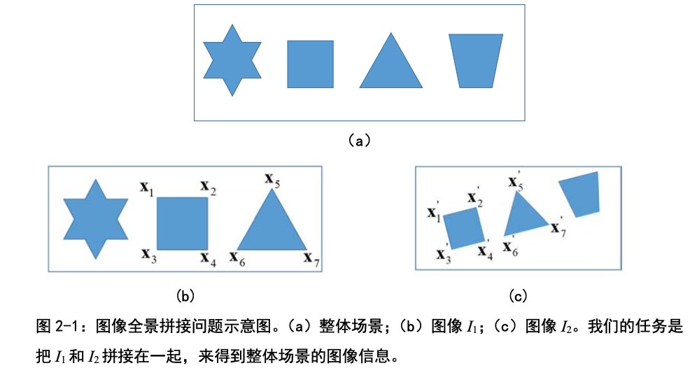

### 2.2 方案流程

- **特征点检测Key Points Detection**：获取特征点$\{\bold{x}\},\{\bold{x}'\}$
  - 用**特征点检测算法**从$I_1$和 $I_2$中检测出高区分性的特征点
  - 图像特征点表达为图像中二维位置坐标
- **创建特征点描述子Feature Description**：获取描述子$\{\bold{d}\},\{\bold{d}'\}$
  - 为每个特征点$\bold{x}$构造其**描述子**$\bold{d}$：一个基于$\bold{x}$的局部图像信息构造出来的向量
  - 如果$I_1$中的特征点$\bold{x}$和$I_2$中的特征点$\bold{x}'$是对应的特征点，则它们的描述子相同。**即物理场景中同一个点的像在两幅图像中的局部信息构造出来的向量相同**。
- **特征点匹配Correspondence Pairs**：获取匹配$S=\{\bold{x}_i\leftrightarrow \bold{x}'_i\}_i^p$
  - 设计基于描述子信息的**特征点匹配算法**，得到特征点对应点对集合$S$
- **几何变换估计Geometric Transformation**：获取线性几何变换$H$
  - 得到特征点对应点集合$S$后可以列出关于线性变换矩阵$H$的线性方程组：$\bold{x_i}'=H\bold{x_i},i=1,...,p$，解方程组得到$H$
  - 为了对抗特征点对应点集合中可能存在的错误对应点对关系，使用**随机采样一致性算法**，从存在外点的观测数据集合中鲁棒地拟合出模型。
- **坐标变换+后处理Transform & Post Processing**
  - 把$I_1$中每个像素点$\bold{x_i}$变换到新位置$H\bold{x_i}$，再经过一些后处理即完成全景拼接
  - 因为$H\bold{x_i}$是浮点数，具体实现要用**图像插值技术**


## 3. 线性几何变换

### 3.1 平面上的线性几何变换

n维向量空间$\mathbb{R}^n$中，对其中元素进行几何变换T为线性几何变换的充要条件是存在**可逆矩阵**$H$使得$∀\bold{x}∈\mathbb{R}^n,T(\bold{x})=H\bold{x}$。

#### 3.1.1 旋转变换 Rotation transformation

平面旋转可表达为：
$$
\begin{bmatrix}x'\\y'\end{bmatrix}=\begin{bmatrix}cos\theta&-sin\theta\\sin\theta&cos\theta\end{bmatrix}\begin{bmatrix}x\\y\end{bmatrix}
$$


- 记矩阵$R_{2\times2}=\begin{bmatrix}cos\theta&-sin\theta\\sin\theta&cos\theta\end{bmatrix}$，它是**行列式为1的正交矩阵**。
- 反过来也成立：如果一个矩阵$R_{2\times2}$是**行列式为1的正交矩阵**，则可以用来表达一个平面内**保持方向**（Orientation Preserving）的旋转。
  - 正交矩阵：$MM^T=E,|M|=±1$
  - 保持方向：不做镜像，只在平面内旋转。此性质由行列式为1保证，行列式为-1导致镜像。

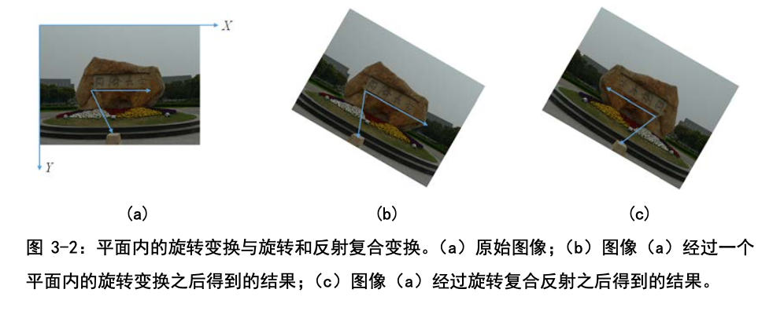

(b)保持方向的旋转，(c)则不是保持方向，进行了镜像（反射）。

**【齐次坐标】**

二维平面的点用三维向量$(x_1,x_2,x_3)^T$表示。

- $x_3=0$，表示**无穷远点**（图形学中表示向量）
- $x_3≠0$，表示正常点
- $(x_1,x_2,x_3)^T==k(x_1,x_2,x_3)^T$，因此只有**2个自由度**


重写旋转变换：
$$
\begin{bmatrix}x'\\y'\\1\end{bmatrix}=\begin{bmatrix}
\cos\theta&-\sin\theta&0\\
\sin\theta&\cos\theta&0\\0&0&1\end{bmatrix}\begin{bmatrix}x\\y\\1\end{bmatrix}
$$
简写为：
$$
\bold{x}'=\begin{bmatrix}R_{2\times2}&\bold{0}_{2\times1}\\\bold{0}_{1\times2}&1\end{bmatrix}\bold{x}
$$
因此，旋转变换的变换矩阵$H$为：
$$
H_{3\times3}=\begin{bmatrix}R_{2\times2}&\bold{0}_{2\times1}\\\bold{0}_{1\times2}&1\end{bmatrix}
$$
其中$R_{2\times2}$是**行列式为1的正交矩阵**。

**平面内的旋转变换自由度为1**：$\theta$。

#### 3.1.2 欧氏变换 Euclidean transformation

**欧氏变换**：同时考虑了旋转、反射、平移的几何变换。CV中不考虑反射，称为**特殊欧氏变换**。

旋转+平移：
$$
\begin{bmatrix}x'\\y'\\1\end{bmatrix}=\begin{bmatrix}
\cos\theta&-\sin\theta&t_x\\
\sin\theta&\cos\theta&t_y\\
0&0&1
\end{bmatrix}\begin{bmatrix}x\\y\\1\end{bmatrix}
$$
简写为：
$$
\bold{x}'=\begin{bmatrix}
R_{2\times2}&\bold{t}_{2\times1}\\
\bold{0}_{1\times2}&1
\end{bmatrix}\bold{x}
$$
因此，欧氏变换的变换矩阵$H$为：
$$
H_{3\times3}=\begin{bmatrix}R_{2\times2}&\bold{t}_{2\times1}\\\bold{0}_{1\times2}&1\end{bmatrix}
$$
其中$R_{2\times2}$是**行列式为1的正交矩阵**，$\bold{t}_{2\times1}=(t_x,t_y)^T$。

**平面内的欧氏变换自由度为3**：$\theta,t_x,t_y$。

#### 3.1.3 相似变换 Similarity transformation

**相似变换**：欧氏变换基础上复合一个各向同性（isotropic）的缩放。

旋转+平移+缩放：
$$
\begin{bmatrix}x'\\y'\\1\end{bmatrix}=\begin{bmatrix}
s\cos\theta&-s\sin\theta&t_x\\
s\sin\theta&s\cos\theta&t_y\\
0&0&1
\end{bmatrix}\begin{bmatrix}x\\y\\1\end{bmatrix}
$$
简写为：
$$
\bold{x}'=\begin{bmatrix}
sR_{2\times2}&\bold{t}_{2\times1}\\
\bold{0}_{1\times2}&1
\end{bmatrix}\bold{x}
$$
因此，相似变换的变换矩阵$H$为：
$$
H_{3\times3}=\begin{bmatrix}sR_{2\times2}&\bold{t}_{2\times1}\\\bold{0}_{1\times2}&1\end{bmatrix}
$$
其中$R_{2\times2}$是**行列式为1的正交矩阵**，$\bold{t}_{2\times1}=(t_x,t_y)^T$，$s≠0$。

**平面内的相似变换自由度为4**：$\theta,t_x,t_y,s$。


#### 3.1.4 仿射变换 Affine transformation

**仿射变换**：旋转+平移+缩放+切变。

相比于欧氏变换，对$R_{2\times2}$矩阵要求放的更低，只要求是非奇异矩阵：

- 奇异矩阵：行列式为0
- **非奇异矩阵**：行列式不为0，也称**可逆矩阵**

$$
\begin{bmatrix}x'\\y'\\1\end{bmatrix}=\begin{bmatrix}
a_{11}&a_{12}&t_x\\
a_{21}&a_{22}&t_y\\
0&0&1
\end{bmatrix}\begin{bmatrix}x\\y\\1\end{bmatrix}
$$

简写为：
$$
\bold{x}'=\begin{bmatrix}
A_{2\times2}&\bold{t}_{2\times1}\\
\bold{0}_{1\times2}&1
\end{bmatrix}\bold{x}
$$
因此，仿射变换的变换矩阵$H$为：
$$
H_{3\times3}=\begin{bmatrix}A_{2\times2}&\bold{t}_{2\times1}\\\bold{0}_{1\times2}&1\end{bmatrix}
$$
其中$A_{2\times2}$是**非奇异矩阵**，$\bold{t}_{2\times1}=(t_x,t_y)^T$，$s≠0$。

**平面内的仿射变换自由度为6**：$a_{11},a_{12},a_{21},a_{22},t_x,t_y,s$。


**【从奇异值分解看仿射变换的几何意义】**

- $A$是二阶非奇异矩阵，因此可以奇异值分解：

$$
A=UDV^T
$$

- 其中$U$和$V$是正交矩阵，$D=\begin{bmatrix}\lambda_1&0\\0&\lambda_2\end{bmatrix},\lambda_1>0,\lambda_2>0$。

- $V$是正交矩阵，因此$VV^t=E$，$A$可以写成：

$$
A=UV^TVDV^T=UV^T(VDV^T)
$$

- 分析这个表达式每个矩阵的几何意义：
  - 两个$\lambda$都为正，所以$D$表示x、y分别缩放，$D=S(\lambda_1,\lambda_2)$
  - $V$是正交矩阵，所以$V和V^T$表示两个相反的旋转，$V^T=R(\phi),V=R(-\phi)$
  - $UV^T$是正交矩阵，所以$UV^T=R(\theta)$
  - 综上，矩阵$A$可以经过奇异值分解表述为：**图像绕原点旋转$\phi$后，X、Y分别缩放$\lambda_1$和$\lambda_2$，再绕原点旋转$-\phi$，最后旋转$\theta$。**
- $det(A)>0$时，仿射变换保持方向性（b图），$det(A)<0$时，图像方向改变。
  - 可以证明：平面上方向不同矢量$a,b$经过仿射变换后，$a',b'$围成平行四边形的**定向面积**与原矢量围成平行四边形的**定向面积**之比为$det(A)$。

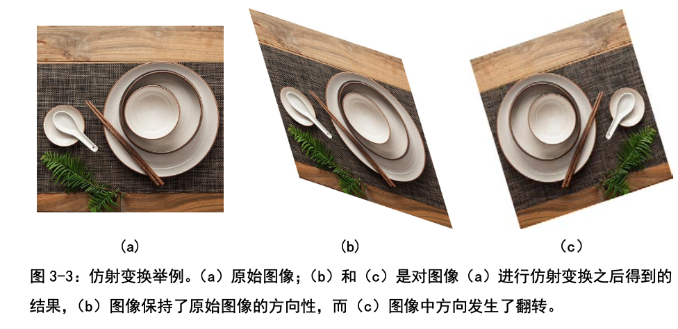

#### 3.1.5 射影变换 Projective transformation

**射影变换**：继续放松对$H$的要求，只要求它是$3\times3$对非奇异矩阵。

- 射影变换**不区分正常点和无穷远点**，该变换可以将两者相互转化。
  - 因此点的坐标不再使用规范化齐次坐标，而**使用一般化齐次坐标**，因为无穷远点没有规范化齐次坐标。
  - $\bold{x}'=H\bold{x}==kH\bold{x},∀k ≠0$，因此射影变换矩阵$H$只有8个自由度。

$$
c\begin{bmatrix}x_1'\\x_2'\\x_3'\end{bmatrix}=\begin{bmatrix}
h_{11}&h_{12}&h_{13}\\
h_{21}&h_{22}&h_{23}\\
h_{31}&h_{32}&h_{33}
\end{bmatrix}\begin{bmatrix}x_1\\x_2\\x_3\end{bmatrix}
$$

**射影变换无法判断是否保持图形方向性。**


### 3.2 变换群与几何学

#### 3.2.1 群的定义

设集合$\mathcal{G}$，在其上元素之间的定义操作$\circ$，$\mathcal{G}$在运算$\circ$下构成群即满足下列条件（**封结幺逆**）：

- **封闭性**：$∀g_1,g_2\in\mathcal{G},\exists g_3\in \mathcal{G}$使得$g_3=g_1 \circ g_2$
- **结合性**：$∀g_1,g_2,g_3\in\mathcal{G},g_1\circ(g_2\circ g_3)=(g_1\circ g_2)\circ g_3$
- **存在单位元（幺元）**：$\exist e\in \mathcal{G}$使得$\forall g\in \mathcal{G},e\circ g=g\circ e=g$，$e$称为$\mathcal{G}$中的单位元
- **每个元素存在逆元**：$\forall g\in \mathcal{G},\exist g^{-1}\in \mathcal{G}$使得$g\circ g^{-1}=g^{-1}\circ g=e$

> 要证明集合在某操作下构成群，即要证明封结幺逆四条属性，即：
>
> - 证明集合内任意两个元素在该操作下的结果属于集合
> - 证明集合内任意三个元素的该操作满足结合律
> - 构造幺元，证明集合内任意元素与之操作结果为自身
> - 对集合内任意元素，构造其逆元，证明两者操作结果为幺元
>
> 详见HW1第1题


#### 3.2.2 线性几何变换群

- **5种线性几何变换的矩阵元素在矩阵乘法下均构成群。**
  - 矩阵元素：如旋转变换矩阵中的$R_{2\times2}$，我们着重讨论的部分

- 推论1：根据群的封闭性，两个同类型几何变换复合的结果依然是这个类型的几何变换。
  - 如两个欧氏变换复合依然是欧氏变换
- 推论2：旋转变换群$\sub$欧氏变换群$\sub$相似变换群$\sub$仿射变换群$\sub$射影变换群
- 变换群下图形保持不变的几何性质
  - 旋转+欧氏：两点距离、两条线夹角、图形面积等
  - 相似：相似比、两条线夹角、直线间平行关系等
    - **相似比**：任意点$\bold{x}_1,\bold{x}_2,\bold{x}_3,\bold{x}_4$，相似比不变即$\frac{||\bold{x}_1\bold{x}_2||}{||\bold{x}_3\bold{x}_4||}=\frac{||\bold{x}_1'\bold{x}_2'||}{||\bold{x}_3'\bold{x}_4'||}$
  - 仿射：简单比值
    - **简单比值**：共线三点$\bold{a},\bold{b},\bold{c}$，简单比值即$(\bold{a},\bold{b},\bold{c})=\frac{\bold{a}\bold{b}}{\bold{b}\bold{c}}$
  - 射影：交比（不讨论）

### 3.3 三维空间中的线性几何变换

- **旋转变换**
  - 其中$R_{3\times3}$为行列式为1的正交矩阵

$$
\bold{x}'=\begin{bmatrix}
R_{3\times3}&\bold{0}_{3\times1}\\
\bold{0}_{1\times3}&1
\end{bmatrix}\bold{x}
$$

- **欧氏变换**
  - 其中$R_{3\times3}$为行列式为1的正交矩阵，平移向量$\bold{t}_{3\times1}=(tx,t_y,t_z)^T$

$$
\bold{x}'=\begin{bmatrix}
R_{3\times3}&\bold{t}_{3\times1}\\
\bold{0}_{1\times3}&1
\end{bmatrix}\bold{x}
$$


- **相似变换**
  - 其中$R_{3\times3}$为行列式为1的正交矩阵，平移向量$\bold{t}_{3\times1}=(tx,t_y,t_z)^T$，尺度缩放系数$s>0$（使得$det(sR)>0$，变换保持方向）

$$
\bold{x}'=\begin{bmatrix}
sR_{3\times3}&\bold{t}_{3\times1}\\
\bold{0}_{1\times3}&1
\end{bmatrix}\bold{x}
$$

- **仿射变换**
  - 其中$A_{3\times3}$为非奇异矩阵，平移向量$\bold{t}_{3\times1}=(tx,t_y,t_z)^T$。

$$
\bold{x}'=\begin{bmatrix}
A_{3\times3}&\bold{t}_{3\times1}\\
\bold{0}_{1\times3}&1
\end{bmatrix}\bold{x}
$$

- **射影变换**
  - 其中c是与点$\bold{x}'$有关的数。

$$
c\begin{bmatrix}x_1'\\x_2'\\x_3'\\x_4'\end{bmatrix}=\begin{bmatrix}
h_{11}&h_{12}&h_{13}&h_{14}\\
h_{21}&h_{22}&h_{23}&h_{24}\\
h_{31}&h_{32}&h_{33}&h_{34}\\
h_{41}&h_{42}&h_{43}&h_{44}
\end{bmatrix}\begin{bmatrix}x_1\\x_2\\x_3\\x_4\end{bmatrix}
$$

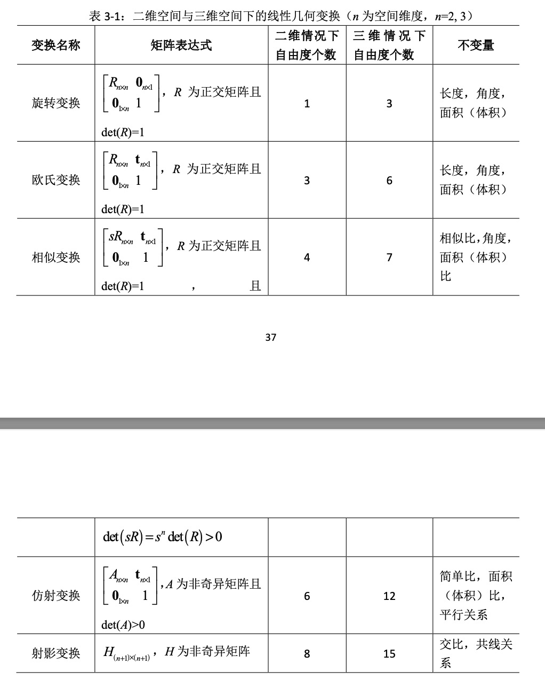


## 4. 特征点检测与匹配

> 1. 特征点检测 Key Point Detection
> 2. 构建特征描述子向量 Feature Descriptor
> 3. 建立特征点匹配关系 Corresponding Pair

希望**图像特征点**性质：

- 局部性：容易准确定位，如角点
- 稀疏性：数量稀少，太多计算开销大
- 对光照变化的稳定性：环境光照条件变化后，希望依然可以找到相同特征点
- 对几何变换的稳定性：相机拍摄视角改变后，图像平面发生几何变换，依然可以检测对应的特征点

希望**特征描述子**性质：

- 高判别性：两个相同特征点的描述子应该相同，不同特征点的描述子应该距离较大
- 对光照变化的稳定性：环境光照条件变化后，希望相应特征点的特征描述子不变
- 对几何变换的稳定性：相机拍摄视角改变后，图像平面发生几何变换，希望相应特征点的特征描述子不变

### 4.1 哈里斯角点及其描述子

#### 4.1.1 哈里斯角点检测算法设计思路

**角点定义**：点$\bold{x}$周围取一个窗口$W$，无论沿着哪个方向移动$W$，新窗口$W'$覆盖的图像区域与旧窗口$W$覆盖的图像区域在像素值上有很大变化。

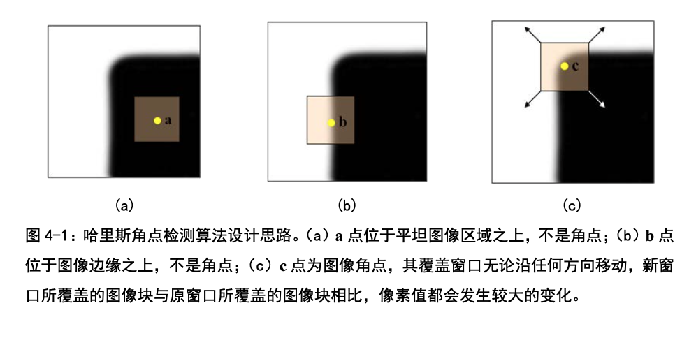

#### 4.1.2 哈里斯角点检测算法实现

- **符号约定**
  - 图像$f$上某点$\bold{x}=(x,y)$
  - 取以$\bold{x}$为中心的窗口$W$
  - $W$移动小量$(\Delta x,\Delta y)$
  - 像素值差异$s_W(\Delta x,\Delta y)$
- **化简像素值差异**推导过程

---

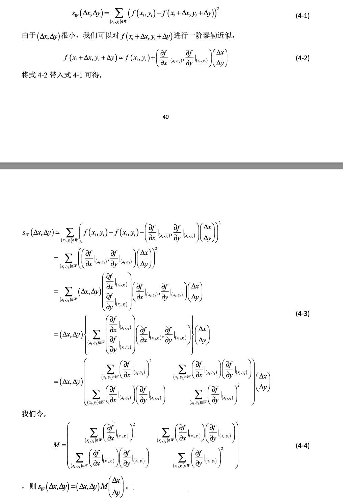

---


- 令像素值变化为常数，如1，得到窗口移动量$(\Delta x,\Delta y)$的轨迹

$$
(\Delta x,\Delta y)M\begin{pmatrix}\Delta x \\ \Delta y\end{pmatrix}=1
$$

- 性质和结论

  - 矩阵$M$为**半正定矩阵**。

  > HW1第2题a)证明了$M$为**半正定矩阵**
  >
  > 大体思路：对这个对称矩阵$M$，利用特征值和它的迹、行列式的关系，证明其特征值都≥0。其中要用到一次柯西不等式。

  - 除非窗口像素全相同，否则在一般情况下矩阵$M$为**正定矩阵**。
  - 当矩阵$M$为**正定矩阵**，上述轨迹为一个**椭圆**

  > HW1第2题b)证明了轨迹为椭圆。
  >
  > 大体思路：将22式展开为$Ax^2+Bxy+Cy^2=1$的形式，利用圆锥曲线判别式$B^2-4AC<0$为椭圆证明。

  - 若矩阵$M$的两个特征值分别为$\lambda_1,\lambda_2$，则椭圆长半轴长度（a）为$\lambda_2^{-1/2}$，短半轴长度（b）为$\lambda_1^{-1/2}$

  > HW1第2题c)证明了椭圆两个半轴长和矩阵$M$两个特征值的关系。
  >
  > 大体思路：将矩阵$M$进行对角化，代入22式，此时展开该式即得到标准椭圆方程$\frac{x^2}{a^2}+\frac{y^2}{b^2}=1$（但此处$x,y$和实际坐标轴的$x,y$不同，因为相当于旋转了坐标轴，去掉$xy$项，但长短轴和两个特征值的关系依然可以通过$a^2,b^2$得到。）

  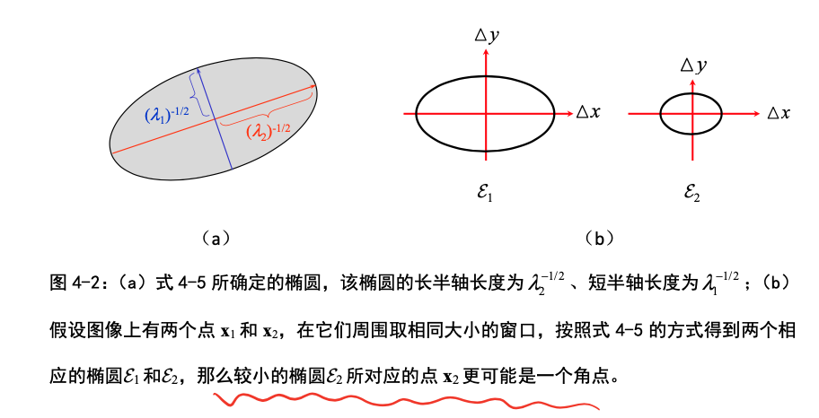

  - **较小、更接近于圆的椭圆更可能是角点**
    - 为使像素变化值$s_W(\Delta x,\Delta y)$达到相同值，较小的椭圆需要窗口移动小量$(\Delta x,\Delta y)$更小，更符合角点定义
    - 更接近圆的椭圆说明无论沿着哪个方向移动窗口都能产生较为一致的像素变化值，而更细长的椭圆更可能对应「边点」
  - 显然，$M$的特征值$\lambda_1,\lambda_2$更大且相近，点$x$更可能是角点

  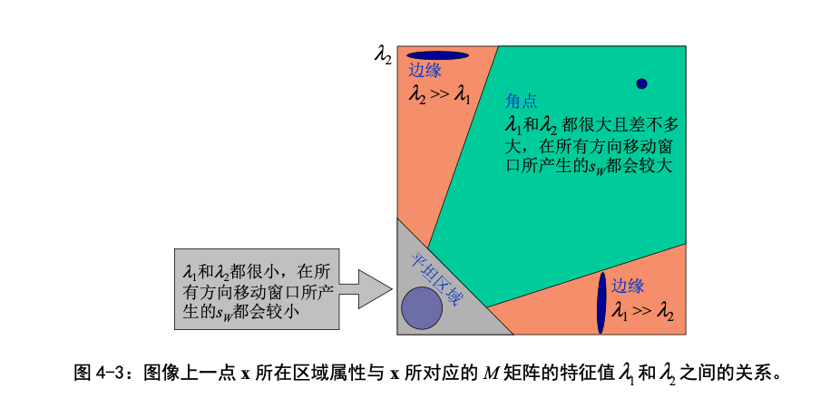

- 编程实现

  - 直接的做法是计算$\lambda_1,\lambda_2$来判断是否角点，但角点检测算法需要应用于图像中的每个点，每次都对$M$进行特征值分解计算开销大
  - 计算点$\bold{x}$**角点程度（cornerness）**的经验公式：
    - 其中超参数$k$事先设定在0.04～0.06
    - $r$越大，该点越可能是角点

  $$
  r(\bold{x})=det(M(\bold{x}))-k(trace(M(\bold{x})))^2
  $$

  - 通过计算矩阵$M$的**行列式**和**迹**来避免特征值分解，而$det(M(\bold{x}))=\lambda_1\lambda_2,trace(M(\bold{x}))=\lambda_1+\lambda_2$，实际上$r$依然完全依赖于特征值。只有$\lambda_1$和$\lambda_2$同时很大，$r$才会很大，与角点定性分析一致。

  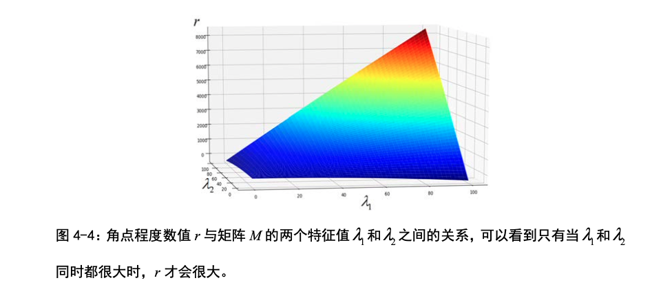

- **非极大值抑制（non-maximum suppression）**：为了角点稀疏性做的后处理。

  - 设定阈值$t$并令$r(\bold{x})>t$得到一堆角点，且因为图像局部连续性，很多角点聚在一起，不符合角点的稀疏性
  - 非极大值抑制操作在一个**预设大小的局部范围内只保留角点程度最大的候选角点**

- 窗口$W$具体形式

  - 定性分析：与点$\bold{x}$距离越近的点对其特征影响越高
  - 算法实现：$W$通常被取为**各向同性的二维高斯窗口**$g(x,y;\delta)$

- 算法流程总结

  - 其中计算图像函数$f$的偏导数需要用到**差分近似**

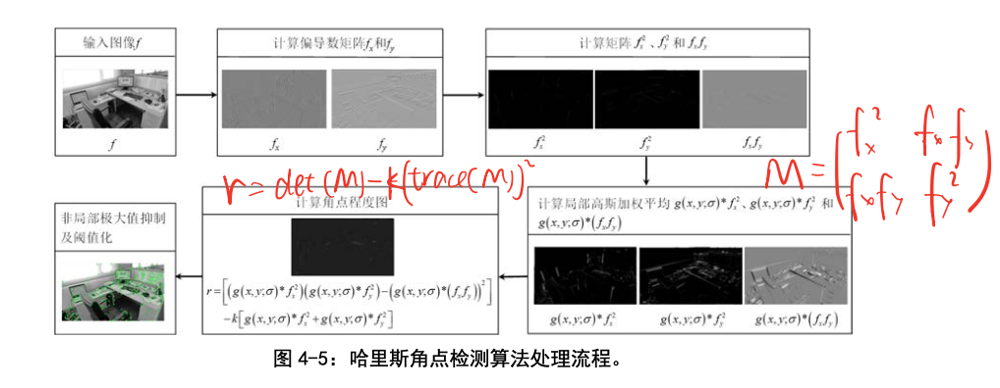

- 哈里斯角点算法性质
  - 角点程度$r(\bold{x})$完全由矩阵$M$决定，而矩阵$M$完全由该点邻域中的一阶偏导数决定，因此哈里斯角点**对图像整体光照变化具有不变性**。即图像函数$f(x,y)$整体增加一个常数项不影响其导数值，也不影响各点角点程度
    - 但对其他类型的光照变化不具有不变性
  - 显然，哈里斯角点**具有旋转不变性**
  - 哈里斯角点**不具有尺度不变性**
    - 根本原因：窗口$W$的大小预先设定，与图像尺度无关

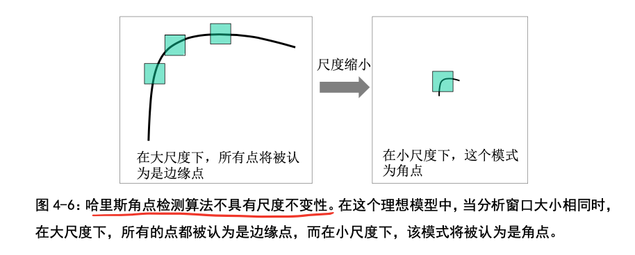

#### 4.1.3 哈里斯角点的特征描述子

- 特征描述子$\bold{d}$：是一个向量，基于点$\bold{x}$的邻域信息构造出来。需要再次取大小$s\times s$的窗口$W$，基于其覆盖的图像区域来构造$\bold{d}$

- **块（block）描述子**：最简单的特征描述子

  - 定义：直接把$s\times s$的窗口$W$拉成一个列向量并正则化，将其作为特征描述子$\bold{d}$

  - 块描述子**不具有旋转不变性、不具有尺度不变性**

  - 计算两个描述子距离的方法：设$\bold{d}_1\in\mathbb{R}^{n\times 1},\bold{d}_2\in\mathbb{R}^{n\times 1}$

    - **平方差之和（Sum of Squared Differences, SSD）距离**

    $$
    SSD_{dist}(\bold{d}_1,\bold{d}_2)=||\bold{d}_1-\bold{d}_2||_2^2=\Sigma^n_{i=1}(d_1^i-d_2^i)^2
    $$

    - **绝对差之和（Sum of Absolute Differences, SAD）距离**

    $$
    SAD_{dist}(\bold{d}_1,\bold{d}_2)=\Sigma^n_{i=1}|d_1^i-d_2^i|
    $$

    - **规范化互相关（Normalized Cross Correlation, NCC）距离**
      - 第二项为皮尔逊线性相关系数，范围$[-1,1]$，因此该距离范围$[0,2]$。也可以把$1-$换成$arccos()$，则距离范围$[0,\pi]$
    
    $$
    NCC_{dist}(\bold{d}_1,\bold{d}_2)=1-\frac{1}{n}\frac{(\bold{d}_1-\mu(\bold{d}_1))·(\bold{d}_2-\mu(\bold{d}_2))}{std(\bold{d}_1)std(\bold{d}_2)}
    $$
    
    

### 4.2 SIFT特征点及其描述子

SIFT：尺度不变特征变换（scale-invariant feature transform）

- **尺度不变特征点**检测
- **尺度不变特征描述子**构建

#### 4.2.1 特征点检测基本思想

- 特征点：**斑点（blob）**，刻画一个斑点需要知道其**中心位置和空间大小**
- **尺度归一化高斯-拉普拉斯算子（scale-normalized Laplacian of Gaussian**），简称尺度归一化LoG算子

---

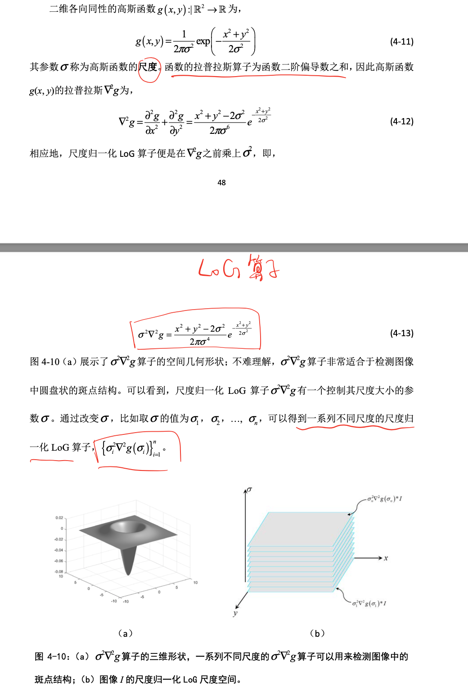

---

- **斑点结构检测问题：本质上是基于模板匹配思想的图像模式检测问题**

  - 假设图像$I$中，点$\bold{x}$为斑点特征的中心位置。用一系列**尺度递增的尺度归一化LoG算子**$\{\sigma^2_i \nabla^2 g(\sigma_i) \}^n_{i=1}(\sigma_{i+1}>\sigma_i)$和$I$**卷积**后，得到$I$的**尺度归一化LoG尺度空间**，如4-10(b)。
  - 该尺度空间中$\bold{x}$对应位置有一组响应值$\{r_i\}^n_{i=1}$，可以看作$\sigma_i$的函数，且只有一个极值

  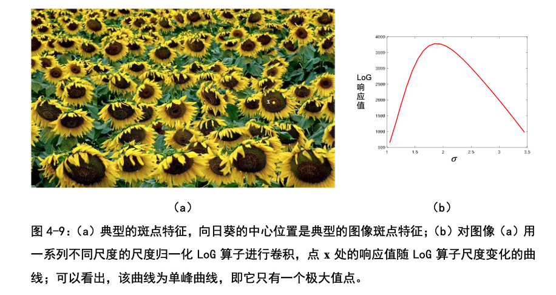

  - 如果该尺度归一化LoG算子$\sigma^2_k \nabla^2 g(\sigma_k)$形状最接近斑点结构，则其对应的$r_k$就是响应值中的极值点，对应的$\sigma_k$为这个斑点结构的**特征尺度**（反映了斑点结构空间大小）
    - 此外，斑点中心$\bold{x}$近邻$\bold{x}'$处的响应值的极值不如$r_k$显著，可以得到稀疏的特征点

- 特征尺度的性质

  - 斑点结构的特征尺度**具有尺度协变性**
    - 图像放大s倍，对应斑点结构的特征尺度$\sigma$也增大s倍
    - 因此可以**基于特征尺度来构建尺度不变的特征点描述子**

  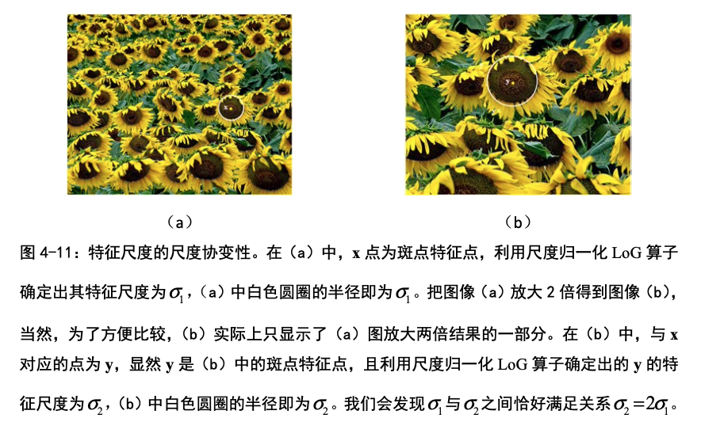

  - 响应值极值点
    - 极大值：中间暗、周围亮
    - 极小值：中间亮、周围暗
  - 显然，斑点结构检测算法**具有旋转不变性**
  - 因为算法是通过在尺度归一化LoG尺度空间中寻找极值点实现，显然**各类光照几乎不会改变局部pattern的相对大小，所以算法对光照变化有很强鲁棒性**。

  

#### 4.2.2 特征点检测算法实现


#### 4.2.3 描述子构造


### 4.3 ORB特征点及其描述子

- **ORB: Oriented FAST and Rotated BRIEF**，包含特征点检测和描述子构造两部分
  - 特征点检测：改进的FAST特征点，引入方向信息，使得具有旋转不变性
  - 描述子构造：改进的二进制描述子BRIEF
- ORB特征提取和匹配代价比SIFT低很多
- ORB具有很好的旋转不变性、尺度不变形、对光照和噪声的鲁棒性

#### 4.3.1 ORB中的特征点检测

- **FAST**：一种角点，检测**局部像素灰度变化明显**的地方，显著特点是**速度快**
- 判定过程：约定符号灰度图$I$，其上一点$\bold{p}$，阈值$t$，FAST-N指超参数$N$
  - 阈值$t$通常取$I(\bold{p})$的20%
  - 取$p$为圆心，3为半径的离散圆上的16个像素（如下图右边）
  - 若圆上有连续$N$个点的亮度与$I(\bold{p})$相差大于$t$，则$p$为一个特征点
    - $N$一般取12，则为FAST-12
  - 为提高搜索效率，增加**预处理测试操作**：对每个$\bold{p}$，测试圆上第1、5、9、13个像素，只有这4个像素中至少3个与$I(\bold{p})$相差大于$t$，$p$才可能是特征点，否则直接排除。
  - 同样需要**非极大值抑制操作**，得到合理的稀疏特征点
  - **FAST特征点响应值**：连续N个点的像素值与$I(\bold{p})$差异平均值
- 提取特征点局部主方向信息：**灰度质心法**
  - 目的：使特征描述子具有旋转不变性
  - 以$\bold{p}$为中心取图像邻域窗口$W$
  - $W$中定义图像块的矩：$m_{pq}=\sum_{(x,y)\in W}x^py^qI(x,y)$
    - $m_{00}=\sum_{(x,y)\in W}I(x,y)$
    - $m_{10}=\sum_{(x,y)\in W}xI(x,y)$
    - $m_{01}=\sum_{(x,y)\in W}yI(x,y)$
  - 计算$W$的质心$\bold{c}=(\frac{m_{10}}{m_{00}},\frac{m_{01}}{m_{00}})$
  - 连接$\bold{p}$和$\bold{c}$得到方向向量$\vec{\bold{pc}}$，进而有$\bold{p}$的局部主方向$\theta=\arctan2(m_{01},m_{10}),\theta\in[0,2\pi)$

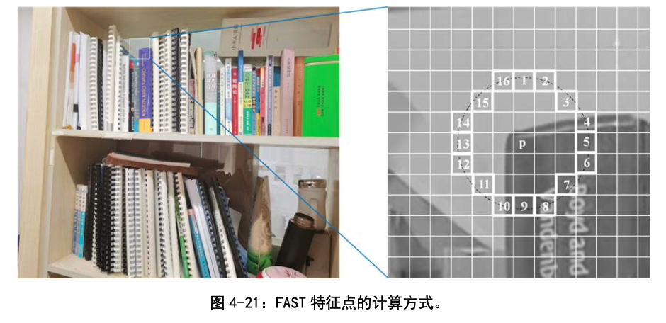

#### 4.3.2 ORB中的特征描述子

- **BRIEF描述子**：描述向量由0和1组成
  - 0和1编码关键点为中心的$s\times s$的窗口内两个随机位置像素值大小关系，如$a>b$取1，反之取0
  - 重复选取128组（或256、512等，下同）随机位置像素值大小关系编码，得到128维特征向量BRIEF-128
  - 位置对的随机模式必须预先固定，且整个算法中唯一确定
  - 因为只编码像素值大小关系，所以BRIEF描述子对**光照变化鲁棒性较强**

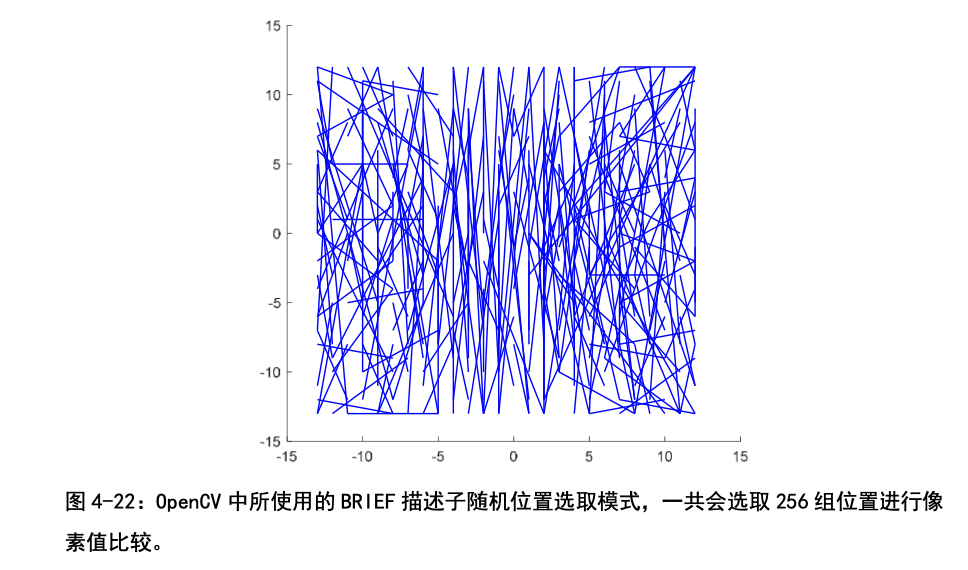

- 改进BRIEF来具有旋转不变性（利用之前的主方向$\theta$）
  - 计算$\bold{p}$的BRIEF向量时，把每个事先选取用于编码的采样位置先绕$\bold{p}$旋转$\theta$，再用旋转之后的像素参与后续编码过程，即可使得BRIEF向量具有旋转不变性
- BRIEF向量距离：**海明距离**
  - $H_{dist}(\bold{b}_1,\bold{b}_2)=\frac{ones_num(\bold{b}_1 \odot \bold{b}_2)}{size(\bold{b}_1)}$
  - $\odot$：按位异或，分子计算两个二进制向量不同位的个数

#### 4.3.3 ORB中的多尺度处理

- 构造图像$I_1$和$I_2$的图像金字塔$\mathcal{G}_1,\mathcal{G}_2$
- 在$\mathcal{G}_1,\mathcal{G}_2$每一层进行FAST特征点提取并构造BRIEF描述子（每一层都使用统一超参数），将特征点位置换算到输入图像的分辨率下
- 获取**图像金字塔**：
  - 给定图像$I$，设**尺度因子**$scale\_factor$（一般1.2）
  - 金字塔第$l$层的尺度参数$s_l=scale\_factor^{l-1}(l=1,...,L)$，L为金字塔总层数
  - 插值下采样得到第$l$层图像，其分辨率为$I$的$\frac{1}{s_l}$
- 获得特征集合（以$\mathcal{G}_1$为例）
  - $\mathcal{O}_1=\{(\bold{x}^1_i,\bold{b}^1_i)\}^N_{i=1}$
  - $(\bold{x}^1_i,\bold{b}^1_i)$是$\mathcal{G}_1$第i个ORB特征信息
  - $\bold{x}^1_i$特征点像素位置（相对于所在金字塔层的图像）
  - $\bold{b}^1_i$该点BRIEF特征向量

### 4.4 特征点匹配

- 根据目前的**特征点检测算法**和**描述子构建算法**，定义符号：
  - 图像$I_1,I_2$
  - 图像$I_1$上特征点集合$\{\bold{x}_i\}^m_{i=1}$，对应的特征描述子集合$\mathcal{P}=\{\bold{d}_i\}^m_{i=1}$
    - 共m个特征点和描述子
  - 图像$I_2$上特征点集合$\{\bold{y}_j\}^n_{j=1}$，对应的特征描述子集合$\mathcal{Q}=\{\bold{e}_j\}^n_{j=1}$
    - 共n个特征点和描述子
  - 两个描述子集合类型相同
- 特征点匹配需要满足的条件（描述子$\bold{d}_i$和$\bold{e}_j$）
  - **距离近**：两个描述子距离要小于阈值$t_1$，距离按照描述子定义的距离算法
  - **双向确认**：$\bold{d}_i$是集合$\mathcal{P}$中距离$\bold{e}_j$最近的元素，反之亦然
  - **不模糊**：$\bold{e}_j$和集合$\mathcal{P}$中距离最近的元素（$\bold{d}_i$）的距离$d_1$和距离第二近的元素的距离$d_2$满足$d_1/d_2<t_2$

- 找出距离最近的描述子
  - 穷举法：适合规模不大、需要在线动态生成的情况
  - 索引结构存储描述子集合：适合离线提前构建，常用索引数据结构有kd-树，spill-树等

## 5. 线性最小二乘问题

- 通过特征点匹配得到两幅图像特征点对关系集合$\mathcal{S}=\{\bold{x}_i \leftrightarrow\bold{x}_i'\}^p_{i=1}$，一共$p$对特征点。
  - $\bold{x}_i,\bold{x}_i'$都是正常点（非无穷远点）
  - $\bold{x}_i,\bold{x}_i'$都是规范齐次坐标
- 考虑最普适性的**射影变换**，$H\in\mathbb{R}^{3\times3}$是具有8个自由度的矩阵
- 从每个点对关系$\bold{x}_i \leftrightarrow\bold{x}_i'$都可以得到下面关于$H$的等式：
  - p对特征点，可以得到p个等式（将$c\mathbf{x}_i'=H_{3\times3}\mathbf{x}_i$展开）

$$
c
\begin{bmatrix}
x_i'\\
y_i'\\
1
\end{bmatrix}
=
\begin{bmatrix}
h_{11} & h_{12} & h_{13}\\
h_{12} & h_{22} & h_{23}\\
h_{31} & h_{32} & h_{33}\\
\end{bmatrix}

\begin{bmatrix}
x_i\\
y_i\\
1
\end{bmatrix}
$$

### 5.1 齐次线性最小二乘问题

#### 5.1.1 问题定义

- 推导过程：

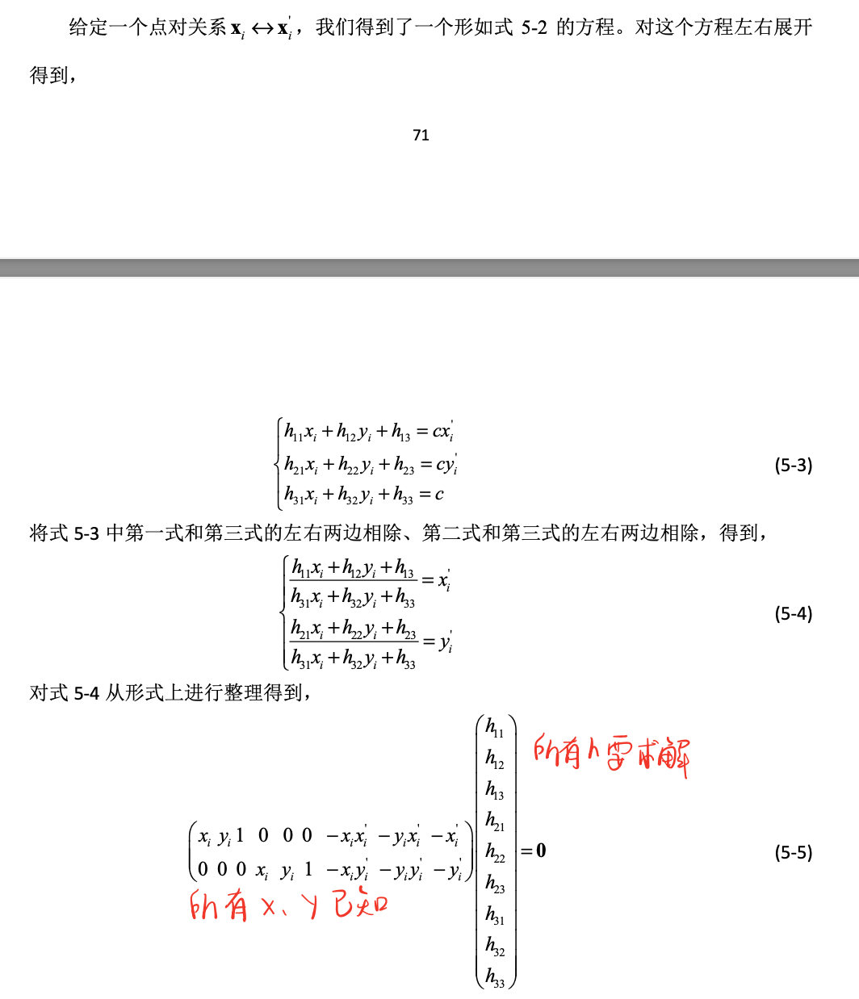

- 每个点对得到2个方程，4对就可以得到8个，足以得到唯一解
- 但有效点对（不存在三点共线）远不止4个，此时根据矩阵理论，只有平凡零解，因此需要用最小二乘法求最适合的非零解$\bold{h}^*$
  - 为避免平凡零解，限制$||\bold{h}||_2^2=1$（9个分量的$\bold{h}$本就只有8个自由度）

- 问题建模：其中$p>4,rank(A)=9$

$$
\bold{h}^*=argmin_h||A\bold{h}||^2_2,\ subject\ to\ ||\bold{h}||^2_2=1,\ A\in \mathbb{R}^{2p\times9},\ \bold{h} \in \mathbb{R}^{9\times1}
$$

- 数学建模：**齐次线性最小二乘问题**（齐次：矩阵方程右边都是0）

$$
\bold{x}^*=arg_hmin||A\bold{h}||^2_2,\ subject\ to\ ||\bold{x}||^2_2=1,\ A\in \mathbb{R}^{m\times n},\ \bold{x} \in \mathbb{R}^{n\times1}
$$

其中$rank(A)=n$。

#### 5.1.2 问题求解

- 思路：带有等式约束的求函数最小值点问题，用**拉格朗日乘子法**。
  - 目标函数：$f(\bold{x})=||A\bold{x}||_2^2$
  - 等式约束：$g(\bold{x})=1-||\bold{x}||_2^2=0$

拉格朗日函数：
$$
L(\bold{x},\lambda)=f(\bold{x})+\lambda g(\bold{x})=||A\bold{x}||_2^2+\lambda(1-||\bold{x}||_2^2)
$$
对拉格朗日函数$L(\bold{x},\lambda)$找出驻点$(\bold{x}_0,\lambda_0)$：

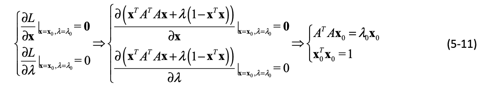

发现$\lambda_0$是矩阵$A^TA$的特征值，对应的单位特征向量为$\bold{x}_0$。

矩阵特征值不止一个（即拉格朗日函数驻点不止一个），对所有可能的解，要找出使得$f(\bold{x})$最小的点。特征向量代入$f(\bold{x})$：（第三个等号是特征值定义，第四个等号利用$||\bold{x}||_2^2=1$）
$$
f(\bold{x}_0)=||A\bold{x}_0||_2^2=\bold{x}_0^TA^TA\bold{x}_0=\bold{x}_0^T\lambda_0\bold{x}_0=\lambda_0
$$
因此，**$f(\bold{x})$最小值就是$A^TA$最小的特征值，解为其对应的单位特征向量**。

### 5.2 非齐次线性最小二乘问题

#### 5.2.1 问题定义

和齐次线性最小二乘问题类似，但固定$h_{33}=1$，这样得出的式子：

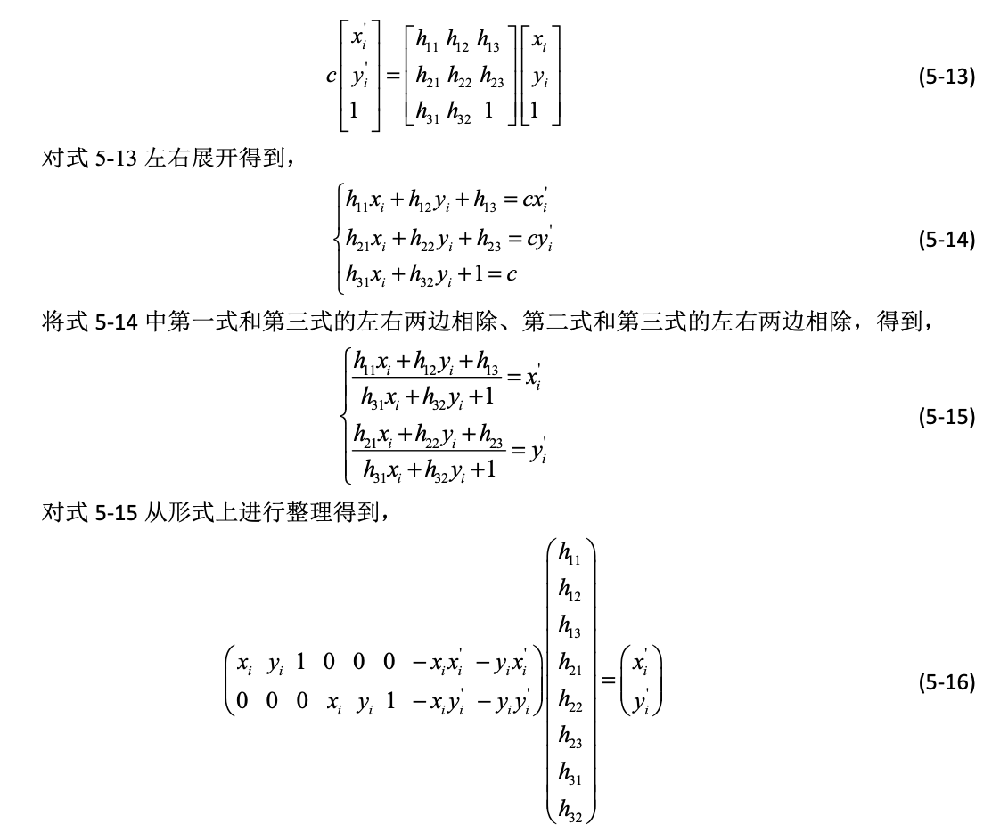

- 问题建模，其中$p>4$，$rank(A_{2p\times8})=8$，$rank(A_{2p\times8};\bold{b})=9$：
  - 和齐次线性最小二乘问题对比，这里没有限制条件$||\bold{h}||_2^2=1$，而是多了$-\bold{b}$项。解向量长度从9变成8。

$$
\bold{h}^*=arg_h min||A\bold{h}-\bold{b}||_2^2,A\in\mathbb{R}^{2p\times8},\bold{h}\in\mathbb{R}^{8\times1},\bold{b}\in\mathbb{R}^{2p\times1}
$$

- 数学建模：**非齐次线性最小二乘问题**（非齐次：矩阵方程右边不都是0）

$$
\bold{x}^*=arg_xmin||A\bold{x}-\bold{b}||^2_2,\ A\in \mathbb{R}^{m\times n},\ \bold{x} \in \mathbb{R}^{n\times1},\bold{b}≠0\in\mathbb{R}^{m\times1}
$$

其中$rank(A)=n$。

#### 5.2.2 问题求解

- 思路：无约束凸优化问题，可以证明目标函数$f(\bold{x})=||A\bold{x}-\bold{b}||^2_2$为凸函数，于是直接向量求导得到驻点：

$$
\bold{x}_s=(A^TA)^{-1}A^T\bold{b}
$$

因为要求了$rank(A)=n$，可以证明$A^TA$可逆。

> HW1第3题根据$rank(A)=n$证明了$A^TA$可逆。
>
> 大体思路：证明$A^TA$可逆就是证明$rank(A^TA)=n$。而$rank(A)=n$，所以要证明$A\bold{x}=0,A^TA\bold{x}=0$同解。于是将前者的解代入后者、后者的解代入前者，证明二者同解，则$rank(A^TA)=rank(A)=n$，矩阵$A^TA$可逆。

#### 5.2.3 基于奇异值分解原理的求解方法


## 6. 射影矩阵的鲁棒估计与图像插值

### 6.1 随机抽样一致算法

- 目前得到了图像$I_1,I_2$的特征点对应关系集合$\mathcal{S}=\{\bold{x}_i \leftrightarrow\bold{x}_i'\}^p_{i=1}$，使用最小二乘法得到了变换矩阵$H$
- 问题：集合$\mathcal{S}$中所有对应关系不应该都正确，如果不去除这些错误对应关系，结果会相差较大
- 问题建模：线性回归中正则化模型z问题
  - **外点**：游离在大部分点组成的**一致集合**之外的点，如图中$p_1,p_2$

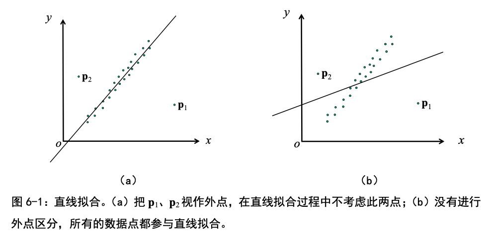

- 解决方法：随机抽样一致算法（Random Sample COnsensus, RANSAC）
  - 迭代过程中，基于从观测数据集中随机选取的观测数据点进行模型拟合，从$\mathcal{S}$中找更好的**一致集合**
  - 一致集合：观测数据集中带入模型后产生误差值小于预设阈值的点的集合

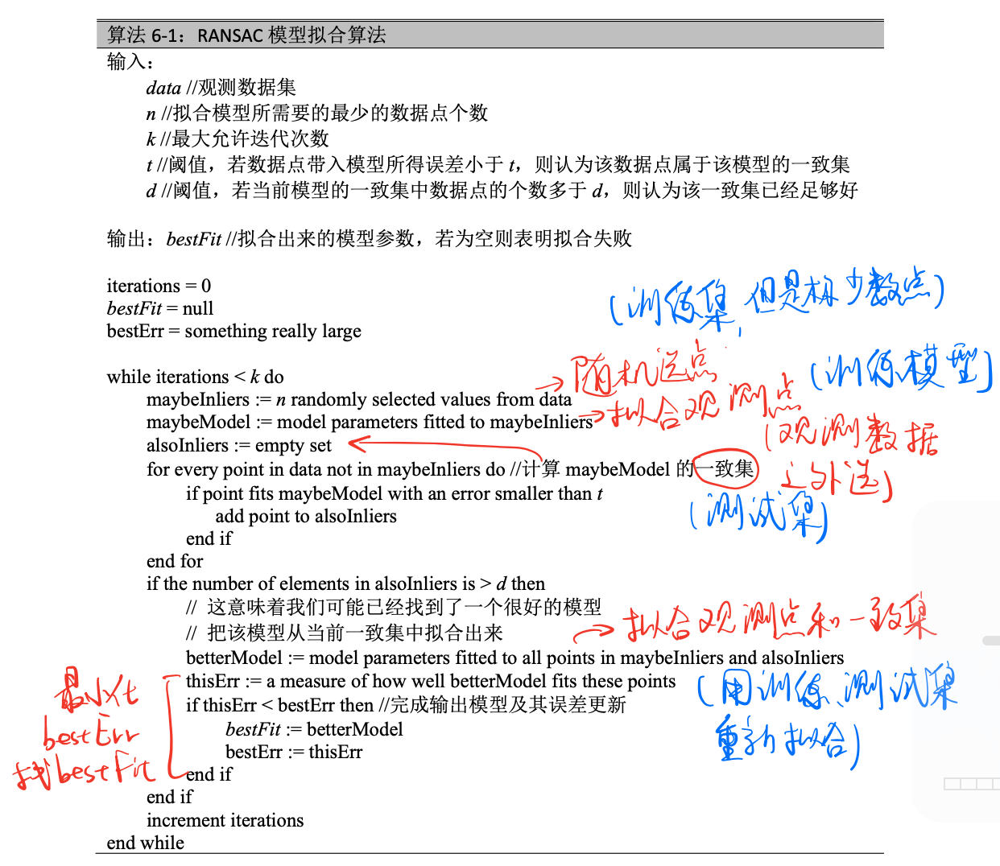

> 下面的代码是HW1第4题给出的RANSAC算法的python实现。

```python
def RANSAC(data, k, n, t, d):
    """
    RANSAC algorithm for fitting a model to noisy data.

    Args:
        data (list): A list of Point objects representing the data points.
        k (int): The maximum number of iterations to perform.
        n (int): The size of the random subset of points to use for fitting the model. Here n = 2.
        t (float): The maximum distance from a point to the model for it to be considered an inlier.
        d (int): The minimum number of inliers required for a model to be considered good.

    Returns:
        Model: The best model found by the algorithm.
    """
    iterations = 0
    bestFit = None
    bestErr = 10**10

    while(iterations < k):
        # fit a model to a random subset of the data
        maybeInliers = random.sample(data, n)
        maybeModel = Model.fit(maybeInliers)

        # build the consensus set
        alsoInliers = []
        for point in data:
            if point not in maybeInliers:
                if maybeModel.distance(point) < t:
                    alsoInliers.append(point)

        # we've found a good model if enough points are in the consensus set
        # now we fit the model again using all the points in the consensus set
        if len(alsoInliers) > d:
            betterModel = Model.fit(maybeInliers + alsoInliers)
            thisErr = betterModel.error(alsoInliers)
            if thisErr < bestErr:
                bestFit = betterModel
                bestErr = thisErr

        iterations += 1

    return bestFit
```


- 具体细节

  - 两点确定一条直线，所以$n=2$
  - 超参数$k,t,d$
  - 数据点带入模型的拟合误差用点到直线距离确定

  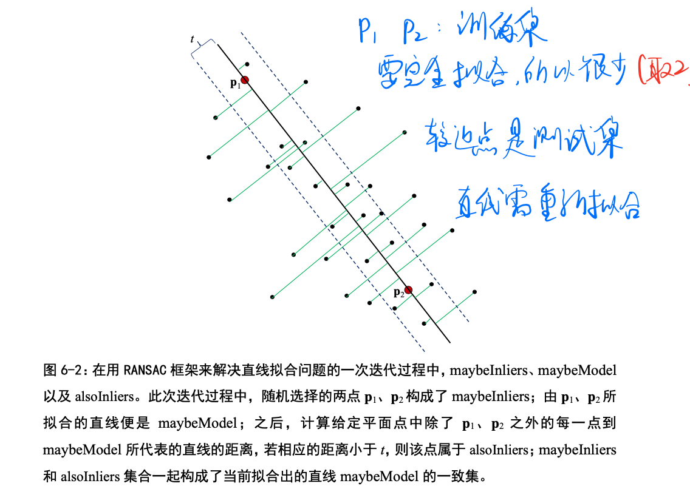

  - 最大迭代次数k计算：先确定内点比例$w$，根据0-1抽样，计算所有n个数据点都是概率为p的情况下k的值：

  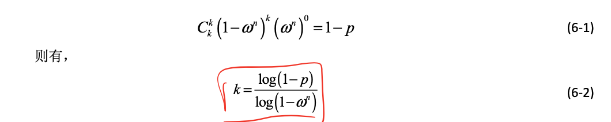

### 6.2 图像插值

- 逆向变换：因为变换后像素点坐标$H\bold{x}_i$不是整数坐标，正向变换无法完成，因此求目的像素点的源像素点，且利用**图像插值**求解

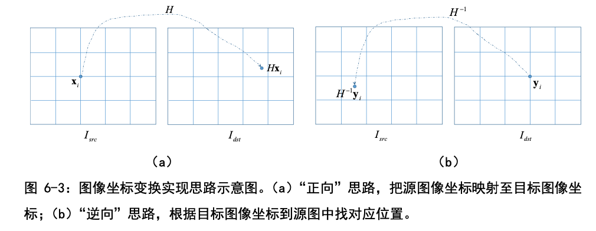

- 双线性插值算法：做三次线性插值，如图

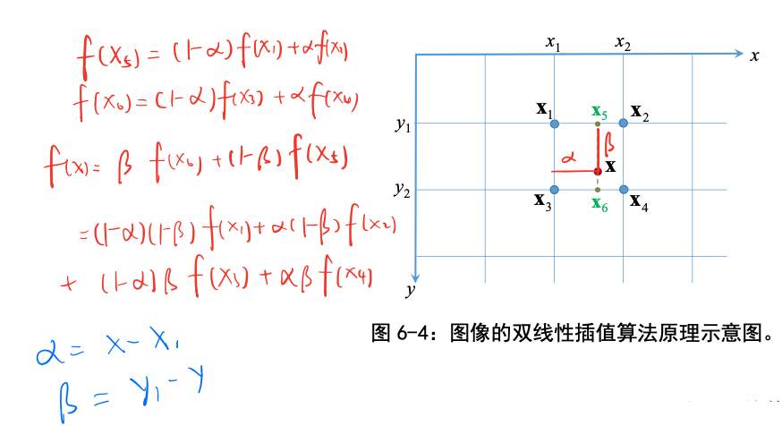

# 二、单目测量


# 三、目标检测


# 四、三维立体视觉
