[toc]

# 一、图像全景拼接

# 二、单目测量

## 第7章 单目测量问题概述

### 7.1 问题定义

- **单目测量问题**：对单张图像上对目标的大小或位置进行测量的问题
- 前提假设：要测量的目标位于一个物理平面上，图像平面与该物理平面满足线性几何变换关系
- 问题关键：事先离线标定，计算图像平面和物理平面之间的线性几何变换H，这样就能把图像上的点映射到物理平面上，得到目标物体的实际几何信息

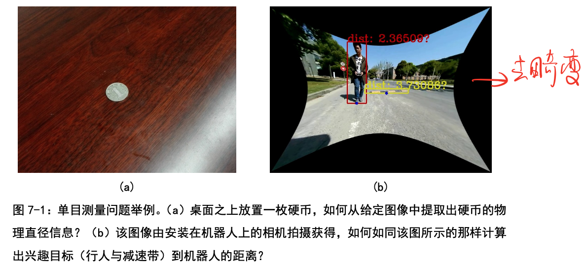

### 7.2 方案流程

- **去畸变处理**
  - 和第一篇中的线性几何变换求解不同，这里要考虑镜头畸变，不能保证物理平面和图像平面一定满足线性几何变换
  - 去畸变处理本质目的：使得相机成像过程严格满足针孔相机成像模型，使得两个平面之间满足线性几何变换
  - 为了进行去畸变需要知道相机内参数
- **获取相机内参数**
  - 参数化相机成像模型中与相机自身有关的参数，其取值仅与相机自身物理属性有关，与其外在空间无关
  - 获取内参数需要进行**内参标定**

- 对采集图像进行**去畸变处理**
  
- **离线外参数标定**
  - 确定相机的去畸变后成像平面与目标物体所处平面的线性几何变换H
  
- 生成物理平面**鸟瞰视图**
  - 目标物体比较扁平，则鸟瞰视图进行观察、检测等更方便

## 第8章 射影几何初步

### 8.1 射影平面

$\pi_0$为一个平面，$O$是面外一个点。要将$\pi_0$扩展为射影平面，引入无穷远点：

- 规定过$O$且与$\pi_0$平行的直线也和$\pi_0$相交，交点称为**无穷远点**
- 过$O$且与$\pi_0$平行的两条不同直线和$\pi_0$相交于不同的无穷远点
- $\pi_0$中每条直线都有唯一对应的无穷远点，**方向平行的两条直线无穷远点相同，反之不同**
- $\pi_0$上所有无穷远点构成**无穷远直线**

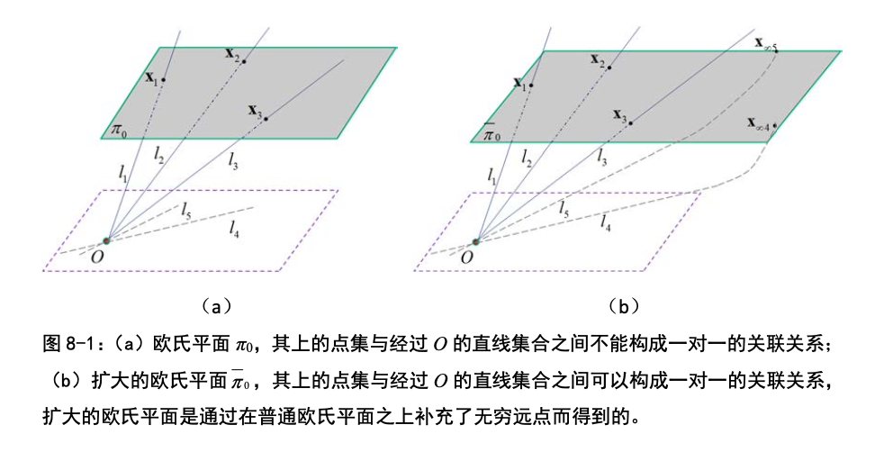

推论：

- $\pi_0$中平行的两条直线相交于其共同的无穷远点
- 过$O$且与$\pi_0$平行的平面与$\pi_0$相交于无穷远直线
- 每条直线两端无限延伸交于无穷远点，即直线概念上封闭

### 8.2 射影平面上点的齐次坐标

- 坐标系定义
  - 射影平面$\bar\pi_0$，其上的平面直角坐标系$[O_1;\bold{e}_1,\bold{e}_2]$
  - $\bar\pi_0$外取一点$O$，令$|OO_1|=1,\vec{OO_1}⊥π_0$，建立空间直角坐标系$[O;\bold{e}_1,\bold{e}_2,\bold{e}_3]$
  - $\bar\pi_0$上一点$m$和$O$形成直线上除$O$外任意一点在坐标系$O$下的坐标称为点$m$在坐标系$O_1$下的**齐次坐标**
  - 严格落在$\bar\pi_0$上的点才有$x_3=1$，但不需要，$x_3≠0$即为有穷点。$\bar\pi_0$上相同的点的齐次坐标成比例，不同点的齐次坐标不成比例。
- 无穷远点的齐次坐标
  - 无穷远点对应过$O$点平行于$\bar\pi_0$的直线，其坐标$(x_1,x_2,0),x_1和x_2不同时为0$
  - 齐次坐标成比例则表示同一个无穷远点，反之表示不同无穷远点
  
  > 值得注意的是，任意一个无穷远点都有其对应的“方向”，因而$\bar{\pi_0}$上直线闭合于它的无穷远点处。给定射影平面上一条直线，应该能**根据其方向向量**唯一确定一个无穷远点的齐次坐标。
  >
  > HW2的第1题是该问题的例题。思路为：对直线$ax+by+c=0$，其方向向量为$(-b,a)$，因此直线上无穷远点的齐次坐标为$(-b,a,0)$（成比例同点），该坐标和$c$无关，只取决于直线的方向向量。
- 齐次坐标和二维坐标关系
  - 点的齐次坐标和二维坐标可以相互确定
    - 通常点：齐次坐标$(x_1,x_2,x_3)$，二维坐标$\lambda(x,y,1)$，则根据上述定义$x=\frac{x_1}{x_3},y=\frac{x_2}{x_3}$
    - 无穷远点：齐次坐标$(x_1,x_2,0)$，则二维平面点$(x,y)=(x_1,y_1)$对应的向量平行于无穷远点对应的$O$中直线；相反，$\bar\pi_0$上一点$(x,y)$之后添一个0即为该方向上无穷远点的齐次坐标$(x,y,0)$
  - 综上，$\bar\pi_0$上一点的齐次坐标只和其二维坐标有关（和$O_1$有关），而与$O$无关

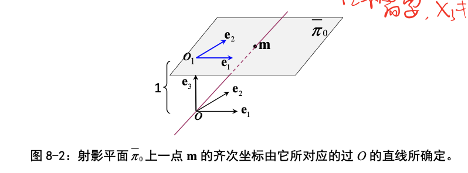

### 8.3 射影平面上的点与直线

- 和欧式平面相同，两点确定一条直线
- 和欧式平面不同，任意两条不同直线都会交于一点，因为没有平行的概念

#### 8.3.1 两点确定的直线

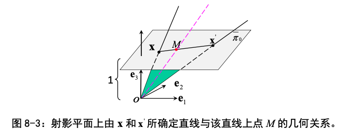

- 问题：射影平面$\bar\pi_0$上两点$\bold{x}={x_1,y_1,z_1},\bold{x}'={x_2,y_2,z_2}$，要求$\bold{x}$和$\bold{x}'$确定的直线方程

- 求解

  - 考虑直线$\bold{x}\bold{x}'$上一点$\bold{m}(x,y,z)$，它位于该直线上等价于直线$OM$和$O\bold{x}$，$O\bold{x}'$共面
  - 对应三个向量共面，则三者混合积为0

  $\begin{bmatrix}x&y&z\\x_1&y_1&z_1\\x_2&y_2&z_2\end{bmatrix}=0$

  - 展开行列式，得到$\bold{x}$和$\bold{x}'$确定的**直线方程**：$\eta_1x+\eta_2y+\eta_3z=0$
  - 将其系数作为直线坐标，得到该**直线的齐次坐标**：$\bold{l}=(\eta_1,\eta_2,\eta_3)$
  - 和点的齐次坐标类似，成比例的齐次坐标表示同一条直线
  - $\bold{l}=(x_1,y_1,z_1)\times(x_2,y_2,z_2)=\bold{x}\times\bold{x}'$

- **定理：射影平面上两点确定的直线**

  - $\bold{x}$和$\bold{x}’$是射影平面上两点齐次坐标，则确定的直线的齐次坐标为$\bold{l}=\bold{x}\times\bold{x}'$
  - 直线方程可以表达为：$\bold{l}·\bold{x}=0$，$\bold{x}$为直线上点的齐次坐标

- 无穷远直线

  - 取两个不同无穷远点，用$\bold{l}=\bold{x}\times\bold{x}'$确定其直线的齐次坐标为$\bold{l}_{\infin}=(0,0,\begin{vmatrix}x_1&y_1\\x_2&y_2\end{vmatrix})$
  - 一般可以写成$k(0,0,1),k≠0$

#### 8.3.2 两条直线所确定的点

- 问题：给定射影平面两条不同直线$\bold{l}=(a_1,b_1,c_1),\bold{l}'=(a_2,b_2,c_2)$，如何求交点坐标
- 求解：就是写出直线方程，增广矩阵秩<列数，得到基础解系$k(\frac{\begin{vmatrix}-c_1&b_1\\-c_2&b_2\end{vmatrix}}{\begin{vmatrix}a_1&b_1\\a_2&b_2\end{vmatrix}},\frac{\begin{vmatrix}a_1&-c_1\\a_2&-c_2\end{vmatrix}}{\begin{vmatrix}a_1&b_1\\a_2&b_2\end{vmatrix}},1),k≠0$
  - 取$k$为分母的值，得$\bold{x}=(...)=\bold{l}\times\bold{l}'$
- **定理：射影平面上求两条直线交点**
  - 射影平面上$\bold{l}$和$\bold{l}'$为两条直线的齐次坐标，则其交点的齐次坐标$\bold{x}=\bold{l}\times\bold{l}'$
  - 和两点确定直线的定理很相似：$\bold{x}$和$\bold{x}’$是射影平面上两点齐次坐标，则确定的直线的齐次坐标为$\bold{l}=\bold{x}\times\bold{x}'$
  - 射影平面上点线等地位，可以做相同处理，引出以下偶命题及其对偶定理
- **对偶命题及其定理**
  - 对偶命题：$\phi(点，线)$是射影平面上一些点和直线关联关系的命题，则$点\rightarrow线$、$线\rightarrow点$、保持关联关系不变和其他表述都不变，得到的命题$\phi(线，点)$是原命题的对偶命题
  - 一个命题$\phi(点，线)$是一条定理，则其对偶命题$\phi(线，点)$也是一条定理
  - 例子
    - 射影平面上三点共线的充要条件是其齐次坐标组成的三阶行列式为0$\leftrightarrow$射影平面上三线共点的充要条件是其齐次坐标组成的三阶行列式为0
    - 一条直线齐次坐标为$\bold{l}$，则直线上点$\bold{x}$满足方程$\bold{l·x}=0$$\leftrightarrow$一固定点齐次坐标为$\bold{x}$，则射影平面上经过点$\bold{x}$的直线$\bold{l}$满足方程$\bold{l·x}=0$

## 第9章 非线性最小二乘问题

### 9.1 无约束优化问题基础

#### 9.1.1 问题定义与基本概念

- 问题：连续可微函数$f(\bold{x}):|\mathbb{R}^n\rightarrow \mathbb{R}$，在其定义域内取值有界，目标是找到其最小值点
  - 如果用高数的方法，求解$\nabla f(\bold{x})=\bold{0}$，该方程只有少数情况有闭式解
  - 通过**迭代优化**求解，找到局部极小值点
- 迭代过程
  - 从初始迭代点$\bold{x}_0$开始，每次迭代产生一个新迭代点$\bold{x}_1$、$\bold{x}_2$...，有限次数内完成收敛到极小值点$\bold{x}^*$
  - 保证$f(\bold{x}_{k+1})<f(\bold{x}_k)$
  - 本质上，迭代每一步是确定**迭代更新向量**，即确定$\bold{h}$得到$\bold{x}_{k+1}=\bold{x}_k+\bold{h}$
  - 收敛到的局部极小值点和初始迭代点$\bold{x}_0$有关，但不一定是离他最近的

#### 9.1.2 阻尼法

> 阻尼法是一个求解无约束优化问题的通用框架，本章将其用于非线性最小二乘问题：在无约束优化问题求连续可微函数$f(\bold{x})$的最小值点的基础上增加目标函数是非线性函数二范数平方的条件。
>
> **本质**：基于刚才的无约束优化问题求解思路，通过构造带有阻尼项的辅助函数来求解更新向量（并更新解$\bold{x}$），并不断调整阻尼系数，直到达成收敛条件（对于非线性最小二乘问题，因其值域≥0，可以通过目标函数已接近于0判定；也可以通过更新向量足够小判定）

- 问题：如何确定$f(\bold{x}):|\mathbb{R}^n\rightarrow \mathbb{R}$在点$\bold{x}$的更新向量$\bold{h}$
- 步骤
  - 辅助函数构造（选择$\bold{c}$和$B$并决定是否启用阻尼）
    - 用$l(\bold{h})$代替$f(\bold{x}+\bold{h})$，即刻画了点$\bold{x}$附近目标函数的形状
  - 更新向量计算（本章就是直接向量求导，因此要求$l(\bold{h})$为凸函数，LM法的辅助函数为凸函数证明在HW3第1题）
    - 计算$\bold{h}^*$也就是计算$l(\bold{h})$的最小值点，也就计算了$f(\bold{x})$在该点附近下一步更新的方向
  - 阻尼系数调整
  - 迭代算法停止条件（当前点已经是驻点或更新向量足够小即可）

> **辅助函数构造**

- 使用简单函数$l(\bold{h}):|\mathbb{R}^n\rightarrow \mathbb{R}$近似这点附近的$f(\bold{x}+\bold{h})$，且满足$l(\bold{0})=f(\bold{x})$，进行如下构造（不是泰勒展开，后面的高斯牛顿法才是基于泰勒展开构造）：
  - $l(\bold{h})=f(\bold{h})+\bold{h}^T\bold{c}+\frac{1}{2}\bold{h}^TB\bold{h}$

  - $\bold{c}\in\mathbb{R}^n$，实对称矩阵$B\in\mathbb{R}^{n\times n}$，需要根据f在这点附近的信息构造
    - 一个具体实现（阻尼牛顿法）：$\bold{c}=\nabla f(\bold{x})$取$f$在$\bold{x}$处梯度，$B=\nabla^2 f(\bold{x})$取$f$在$\bold{x}$处海森矩阵
    
      > 阻尼牛顿法和列文伯格-马夸尔特法：前者是阻尼法（框架）的一个具体实现，明确指出$\bold{c},B$的取法；后者与高斯牛顿法都是非线性最小二乘问题的解法，GN法也指出了$\bold{c},B$的取法，LM法启用了阻尼项。
    
  - 现在目标变成：找到$\bold{h}_{dm}=arg_h \min l(\bold{h})$

  - $||\bold{h}||$足够小，才可以很好近似，因此添加**阻尼项**：
    - $\bold{h}_{dm}=arg_h \min \{l(\bold{h})+\frac{1}{2}\mu\bold{h}^T\bold{h}\}$
    - $\mu$为阻尼系数

> **更新向量计算**

- 求目标函数驻点（也即本轮求解得到的更新向量）：$\bold{h}_{dm}=-(B+\mu I)^{-1}\bold{c}$，$I$为单位矩阵

  - 推导：

  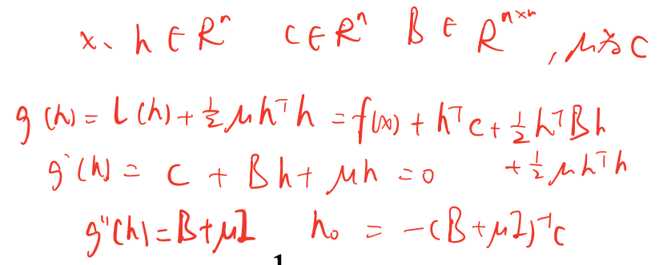

  - 让该驻点为全局最小值点的解的条件：目标函数的海森矩阵正定，则其局部极小值点也是全局最小值点
    - 目标函数$l(\bold{h})+\frac{1}{2}\mu\bold{h}^T\bold{h}$的海森矩阵$B+\mu I$，和$\bold{h}$无关，则可以让$\mu$取合适的值使得海森矩阵为正定矩阵，此时目标函数为凸函数

- 接受这个解并迭代的条件：近似函数$l(\bold{h})$求出的解能使得$f(\bold{x}_{k+1})<f(\bold{x}_k)$

> **阻尼系数调整**

- 调整$\mu$准备下一次计算更新向量（不管解是否被接受）

  - 若解$\bold{h}_{dm}$不够好（$l(\bold{h})$下降了很多，但$f(\bold{x})$没有下降很多），则不能太信任近似函数$l(\bold{h})$，需要加大阻尼项来加强惩罚，$\mu$变大；反之$\mu$变小
  - 定义刻画解$\bold{h}_{dm}$理想程度的值：增益比gain ratio：$\rho=\frac{f(\bold{x})-f(\bold{x+\bold{h}_{dm}})}{l(\bold{0})-l(\bold{\bold{h}_{dm}})}$
  - 两种$\mu$值调整算法

  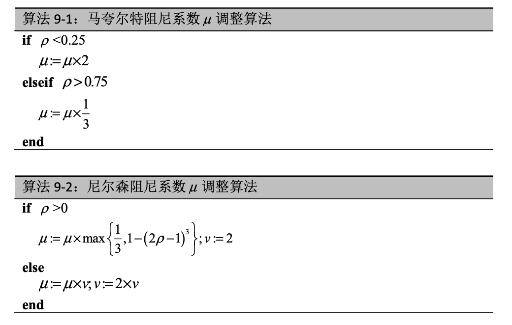

> **迭代算法停止条件**在列文伯格-马夸尔特法里具体讲

### 9.2 非线性最小二乘问题及其解法

#### 9.2.1 问题定义与基本概念

- **非线性最小二乘问题**
  
  - 第五章中的线性最小二乘问题：$f(\bold{x})=\frac{1}{2}||A\bold{x}-\bold{b}||^2_2,A\in \mathbb{R}^{m\times n},\bold{x}\in \mathbb{R}^{n\times 1},\bold{b}\in \mathbb{R}^{m\times 1}$
  - 写成向量形式：$f(\bold{x})=  \frac {1}{2}  \sum _ {i=1}^ {m}  f_ {i}^2 (\bold{x})= \frac {1}{2} ||\bold{f}(\bold{x})||^2_2= \frac {1}{2} \bold{f}^T(\bold{x})\bold{f}(\bold{x})$
  - $f_i(\bold{x})$中与$\bold{x}$有关的部分为线性函数，则为**线性最小二乘问题**；反之，成为**非线性最小二乘问题**，只能用迭代优化求解
  
  > 第五章中线性最小二乘问题的求解思路：目标函数为严格凸函数，具有闭式解，因此直接向量求导得驻点。
  >
  > 本章以该问题的形式（主要是熟悉向量形式的自变量和因变量）引出的是**非线性最小二乘问题**：相比第五章的问题变成了非线性，不能当成凸函数求解；相比9.1节的无约束优化问题，多了二乘的条件，既有更清晰的形式、便于求梯度和利用雅各比矩阵$J(\bold{x})$，也有值域≥0、多一条判定收敛的方法。
  
- 矢量函数$\bold{f}(\bold{x})$的雅可比矩阵$J(\bold{x})$：由$\bold{f}(\bold{x})$分量（向量->标量函数）的一阶偏导数组成

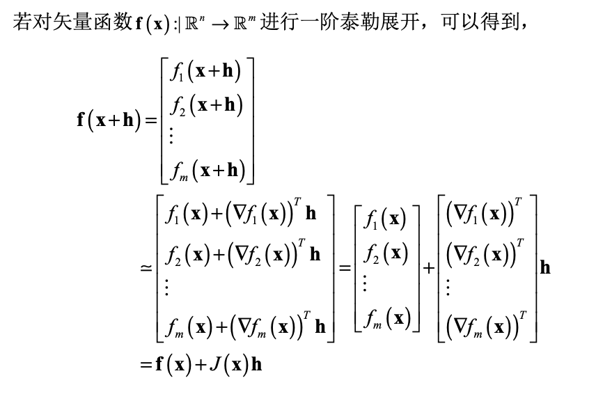

- 目标函数$f(\bold{x})=\frac{1}{2}||\bold{f}(\bold{x})||_2^2$梯度：矢量函数$\bold{f}(\bold{x})$的雅可比矩阵转置与其自身相乘

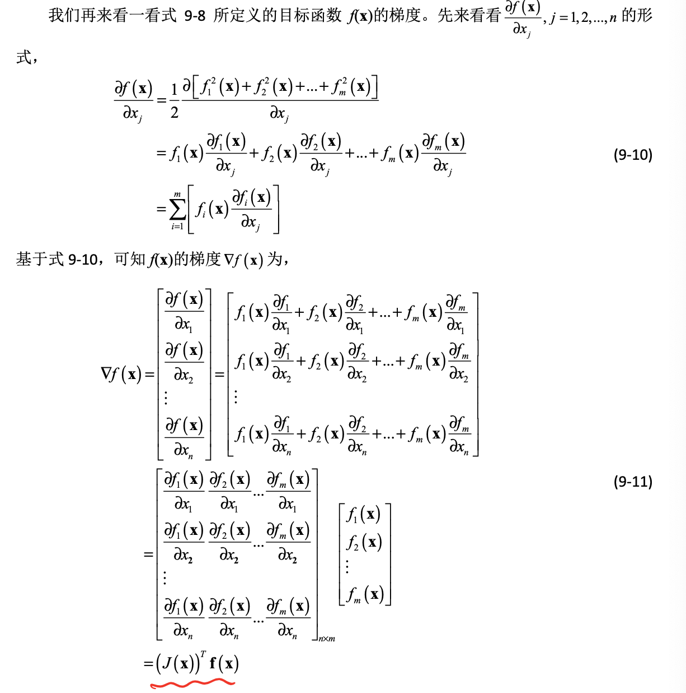

#### 9.2.2 高斯牛顿法

> 高斯牛顿法可以认为是$\Delta=\inf$的trust-region法（slides Lecture 05），或者$\mu=0$的阻尼法。

- 高斯牛顿法是**基于泰勒展开进行构造、阻尼系数=0**的用于解决非线性最小二乘问题的阻尼法
- 基于$\bold{f}(\bold{x})$在$\bold{x}$附近的**一阶泰勒**展开构造，即9.1.2中$\bold{c}=J^T(\bold{x})\bold{f}(\bold{x}),B=J^T(\bold{x})J(\bold{x})$
- 取近似：$\bold{f}(\bold{x}+\bold{h})\approx\bold{f}(\bold{x})+J(\bold{x})\bold{h}$
- 目标函数被近似为：（下面和无约束优化问题一样，即求解使得该替代函数$l(\bold{h})$）最小的更新向量$\bold{h}_{gn}=arg_h\min l(\bold{h})$

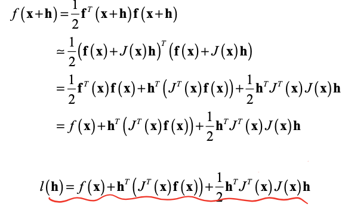

- 容易求得$l(\bold{h})$驻点为$-(J^T(\bold{x})J(\bold{x}))^{-1}J^T(\bold{x})\bold{f}(\bold{x})$
  - 需要附加额外条件：雅可比矩阵$J(\bold{x})$列满秩，则$J^T(\bold{x})J(\bold{x})$必正定，则该驻点就是全局最小点

#### 9.2.3 列文伯格-马夸尔特法

- 高斯牛顿法+阻尼项=LM法，或者说阻尼法+取$\bold{c},B$为带雅可比矩阵的值=LM法
- 计算更新向量：$\bold{h}_{lm}=arg_h\min\{l(\bold{h})+\frac{1}{2}\mu\bold{h}^T\bold{h}\}$
- 计算驻点：$-(J^T(\bold{x})J(\bold{x})+\mu I)^{-1}J^T(\bold{x})\bold{f}(\bold{x})$

>  这里驻点的计算是直接对辅助函数
> $$
> \begin{align}
> L(\bold{h})
> &=l(\bold{h})+\frac{1}{2}\mu\bold{h}^T\bold{h}\\
> &=\frac{1}{2}(\bold{f}(\bold{x}))^T\bold{f}(\bold{x})+\bold{h}^T(J^T(\bold{x}))^T\bold{f}(\bold{x})+\frac{1}{2}\bold{h}^T(J^T(\bold{x}))^TJ^T(\bold{x})\bold{h}+\frac{1}{2}\mu\bold{h}^T\bold{h}
> \end{align}
> $$
> 向量求导求得。
>
> 该方法成立需要满足辅助函数是严格凸函数，也即函数二阶可微分、海森矩阵正定。HW3第1题给出了证明。
>
> 大体思路：对$L(\bold{h})$二阶微分得到其海森矩阵$\bold{H}(\bold{x}) \equiv∇^2L(\bold{h})=(\bold{J}(\bold{x}))^T\bold{J}(\bold{x})+\mu I$，
>
> 要证明其正定，可以证明对所有非零向量$\bold{z}$，满足$\bold{z}^T\bold{H}(\bold{x})\bold{z}>0$。
>
> 代入算到结果为两个二范数平方之和，又因$\bold{z}$非零，结果必然>0。

- GN法需要$J(\bold{x})$列满秩，才能保证$J^T(\bold{x})J(\bold{x})$可逆；而LM法不需要$J(\bold{x})$列满秩，$J^T(\bold{x})J(\bold{x})+\mu I$一定正定

- 设置$\mu$的初始值$\mu_0$

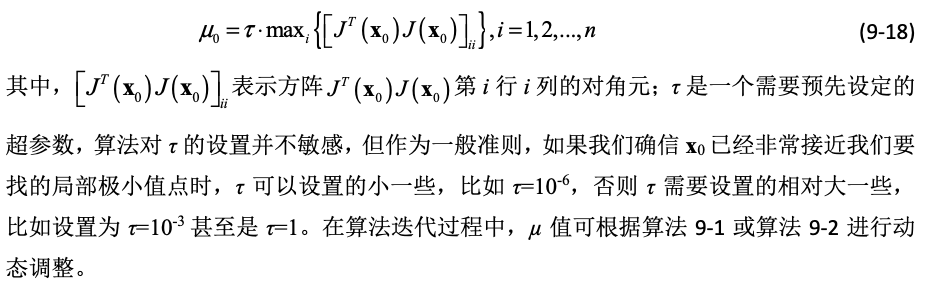

- 设置迭代终止条件
  - 目标函数$f$在当前迭代点梯度已经为0，则为极小值点：$||\nabla f(\bold{x})||_{\infin}≤\varepsilon_1$
    - $\varepsilon_1$为很小的正数，左边计算了无穷范数
  - 更新向量已经非常小：$||\bold{h}_{new}||_2≤\varepsilon_2(||\bold{x}||_2+\varepsilon_2)$
  - 迭代次数超过最大限制

- 伪代码

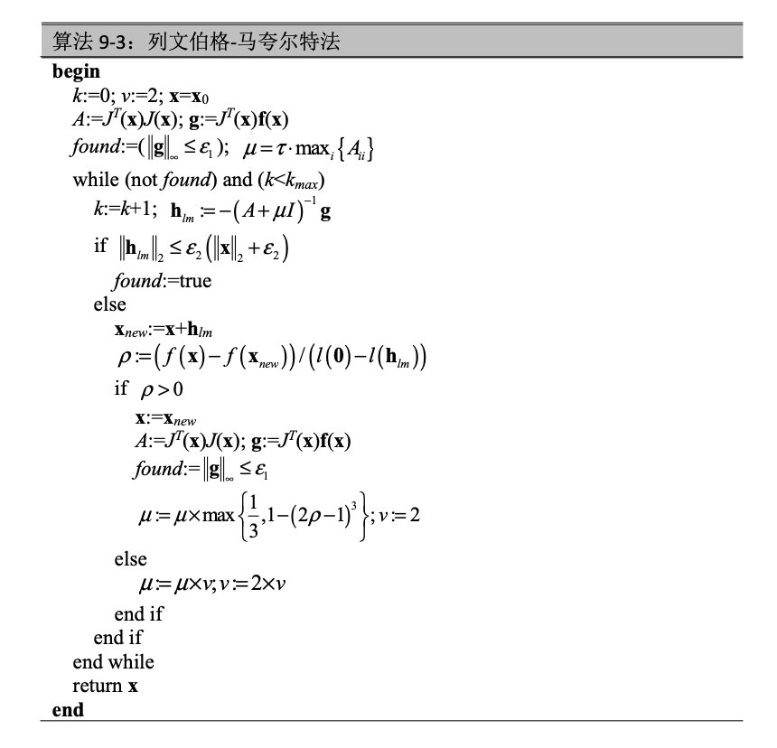

## 第10章 相机成像模型与内参标定

### 10.1 不考虑镜头畸变的成像模型

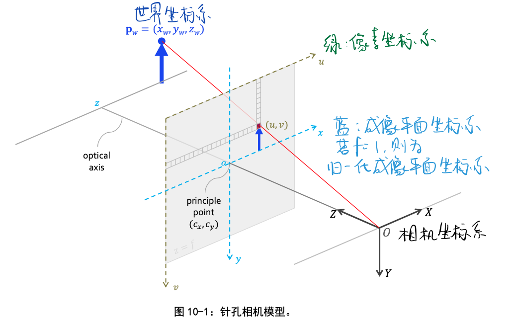

- **世界坐标系**中一点的坐标$\bold{p}_w=(x_w,y_w,z_w,1)^T$
- **相机坐标系**：$\bold{p}_c$，相机坐标系和世界坐标系可以通过旋转+平移刻画：
  
  - $\bold{p}_c=\begin{bmatrix}x_c\\y_c\\z_c\end{bmatrix}=\begin{bmatrix}R_{3\times3}&\bold{t}_{3\times1}\end{bmatrix}\bold{p}_w$
  
  > 这一步变换类似欧氏变换，但所用矩阵为$3\times4$的，因为相机坐标系下不使用齐次坐标，就不需要最后一行。
- 成像平面：到光心$O$距离为$f$，垂直于$Z$轴且在其正向的平面
- **成像平面坐标系**（二维平面坐标系）：原点即为$Z$轴与该平面交点，xy轴与相机坐标系的xy轴平行同方向，根据相似三角形得到：
  
  - $\begin{bmatrix}x\\y\\1\end{bmatrix}=\frac{1}{z_c}\begin{bmatrix}f&0&0\\0&f&0\\0&0&1\end{bmatrix}\begin{bmatrix}x_c\\y_c\\z_c\end{bmatrix}$
- **归一化成像平面坐标系**：令$f=1$即可
  
  - $\begin{bmatrix}x_n\\y_n\\1\end{bmatrix}=\frac{1}{z_c}\begin{bmatrix}x_c\\y_c\\z_c\end{bmatrix}$
  - 归一化成像平面坐标只和$\bold{p}_c$的坐标比值有关

- **像素坐标系**：考虑uv轴不垂直，dx、dy为像素宽度，单位mm/pixel，从图中容易写出

  - 主点坐标：成像平面坐标系原点$o$（也即相机光心$O$的像）在像素坐标系下的坐标$(c_x,c_y)$
  - $\begin{bmatrix}u\\v\\1\end{bmatrix}=\begin{bmatrix}\frac{1}{dx}&\frac{\tan\alpha}{dx}&c_x\\0&\frac{1}{dy}&c_y\\0&0&1\end{bmatrix}\begin{bmatrix}x\\y\\1\end{bmatrix}$

  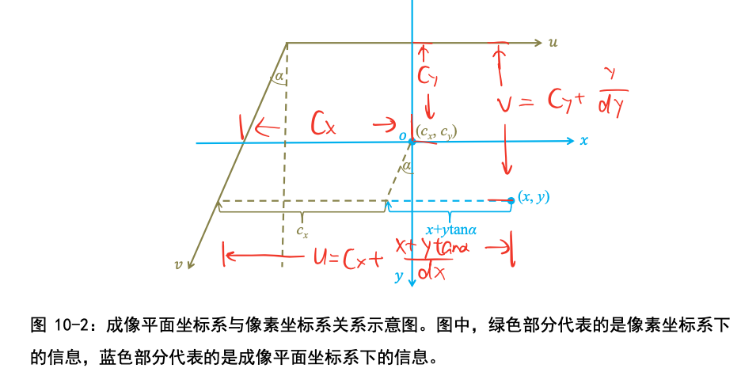
- **完整映射过程**

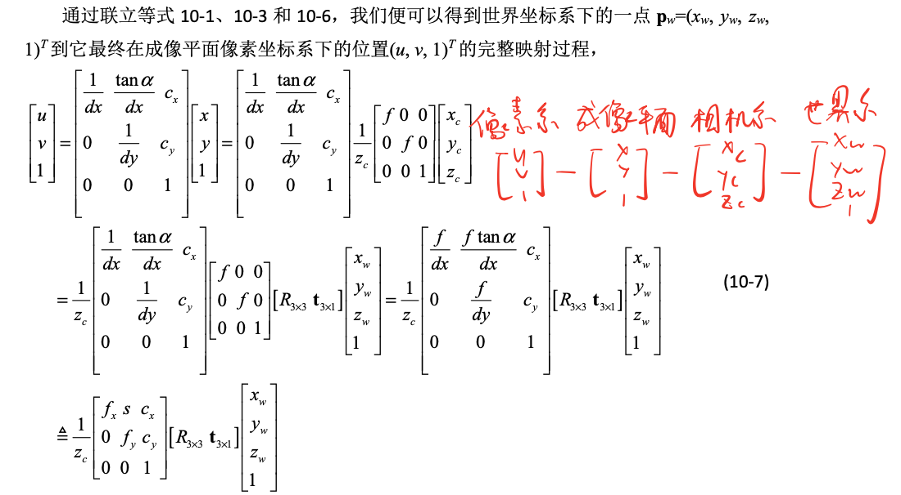

- **内参矩阵**：$K=\begin{bmatrix}f_x&s&c_x\\0&f_y&c_y\\0&0&1\end{bmatrix}$，$f_x,f_y$为相机在x方向和y方向的**焦距**，s为**扭曲参数**，刻画了uv不垂直性（后面认为**s=0**，OpenCV源代码也是如此）

- **外参数**：$R,\bold{t}$都只和相机位姿有关

- 最终成像表达式（很重要，后面反复出现）

  - $\bold{p}_w=\begin{bmatrix}x_w\\y_w\\z_w\\1\end{bmatrix}$：三维世界坐标系中一点的归一化齐次坐标
  - $\bold{u}=\begin{bmatrix}u\\v\\1\end{bmatrix}$：点$\bold{p}_w$在最终像素坐标系下的归一化齐次像素坐标

  $$
  \bold{u}=\frac{1}{z_c}K[R_{3\times3}\ \bold{t}_{3\times1}]\bold{p}_w
  $$

  

  - 根据归一化成像平面坐标系定义$\begin{bmatrix}x_n\\y_n\\1\end{bmatrix}=\frac{1}{z_c}\begin{bmatrix}x_c\\y_c\\z_c\end{bmatrix}=\frac{1}{z_c}\begin{bmatrix}R_{3\times3}&\bold{t}_{3\times1}\end{bmatrix}\begin{bmatrix}x_w\\y_w\\z_w\\1\end{bmatrix}$，可得：

  $$
  \bold{u}=K\begin{bmatrix}x_n\\y_n\\1\end{bmatrix}
  $$

  

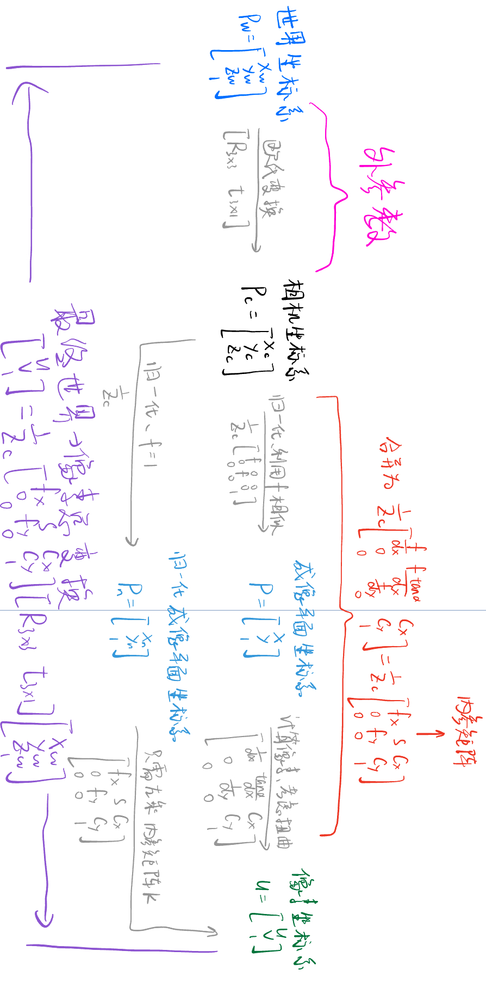

### 10.2 考虑镜头畸变的成像模型

#### 10.2.1 普通镜头畸变模型

- 径向畸变radial distortion：光线在透镜边缘弯曲程度大于在透镜光学中心的弯曲程度
  - 枕型畸变pincushion distortion
  - 桶型畸变barrel distortion

- 径向畸变建模：**归一化成像平面坐标系下坐标**在畸变前后的坐标关系为

  $x_{dr}=x_n(1+k_1r^2+k_2r^4+k_3r^6)$

  $y_{dr}=y_n(1+k_1r^2+k_2r^4+k_3r^6)$

  其中$r^2=x_n^2+y_n^2$

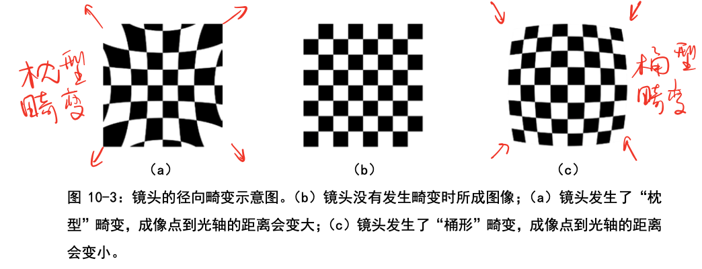

- 切向畸变tangential distortion：镜头平面和成像器件平面不严格平行

- 切向畸变建模：**归一化成像平面坐标系下坐标**在畸变前后的坐标关系为

$x_{dt}=x_n+(2\rho_1x_ny_n+\rho_2(r^2+2x_n^2))$

$y_{dt}=y_n+(2\rho_2x_ny_n+\rho_1(r^2+2y_n^2))$

其中$r^2=x_n^2+y_n^2$

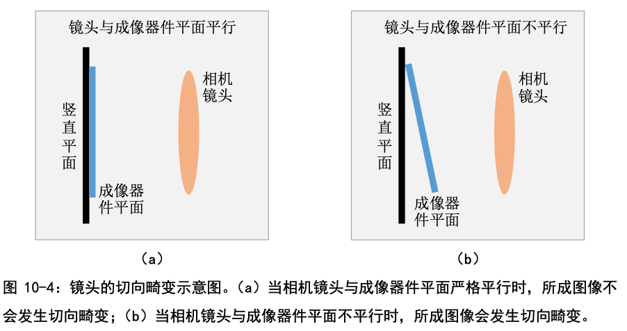

- 径向+切向畸变建模
  - 相机畸变参数（也是内参数）：$k_1,k_2,\rho_1,\rho_2,k_3$

$x_{d}=x_n(1+k_1r^2+k_2r^4)+2\rho_1x_ny_n+\rho_2(r^2+2x_n^2)+x_nk_3r^6$

$y_{d}=y_n(1+k_1r^2+k_2r^4)+2\rho_2x_ny_n+\rho_1(r^2+2y_n^2)+y_nk_3r^6$

- 引入畸变算子$\mathcal{D}$来表示畸变，得到完整相机成像模型
  - $\mathcal{D}$是畸变**算子**，**镜头畸变不能建模成矩阵相乘**。

$\bold{u}=K·\mathcal{D}\{\frac{1}{z_c}[R\ \ \bold{t}]_{3\times4}\bold{p}_w\}$

其中$\{\frac{1}{z_c}[R\ \ \bold{t}]_{3\times4}\bold{p}_w\}$就是归一化成像平面的坐标，从世界坐标系坐标$\bold{p}_w$经过相机位姿欧氏变换、除以$\frac{1}{z_c}$归一化（$f=1$，不需要算相机坐标系到成像平面坐标系的相似三角形变换）。

畸变建模的是归一化成像平面上的改变，还没有涉及到像素平面的变换，因此先运算畸变，再乘以相机内参矩阵$K$。

#### 10.2.2 鱼眼镜头畸变模型

了解，不考虑

### 10.3 相机内参标定

#### 10.3.1 相机内参标定算法基本流程

- **相机的内参标定**：求解相机内参数，即$\{f_x,f_y,c_x,c_y,k_1,k_2,\rho_1,\rho_2,k_3\}$，的过程。本节标定不仅求解内参数，还求解外参数，即每张用于标定图片的相机位姿$\{R_i\ \bold{t}_i\}$。

- 思路：已知一组世界坐标下的点$\{\bold{p}_{wj}\}_{j=1}^n$及其对应的像素坐标$\{\bold{u}_{j}\}_{j=1}^n$（都是齐次坐标），即可根据10.2节得到的成像模型列出方程组，解出关于相机模型的待定参数。

  - **标定板**：黑白棋盘格，交叉点为选取的样本点。标定板需满足行列格数奇偶性不同，以避免旋转对称导致的歧义性。一般选取最角落的交叉点为原点，沿交叉点多的边选为$X$轴，沿交叉点少的边选为$Y$轴。

  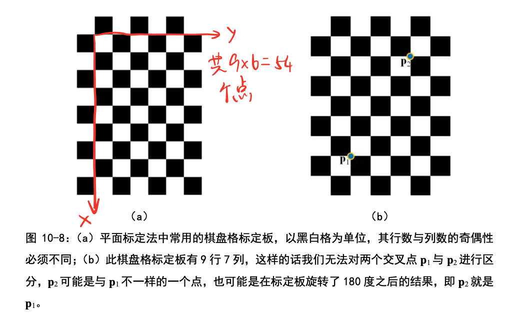

  - **交叉点**：标定板准备好后立即得到$\{\bold{p}_{wj}\}_{j=1}^n$，因点都处于$XOY$平面上，故其中$\bold{p}_{wj}=(x_j,y_j,0,1)^T$。点数为$9\times6=54$。

  - **拍摄图像**：在不同位置拍摄标定图像$\{I_i\}_{i=1}^m$，每次拍摄相机的位姿为$(R_i,\bold{t}_i)$。

  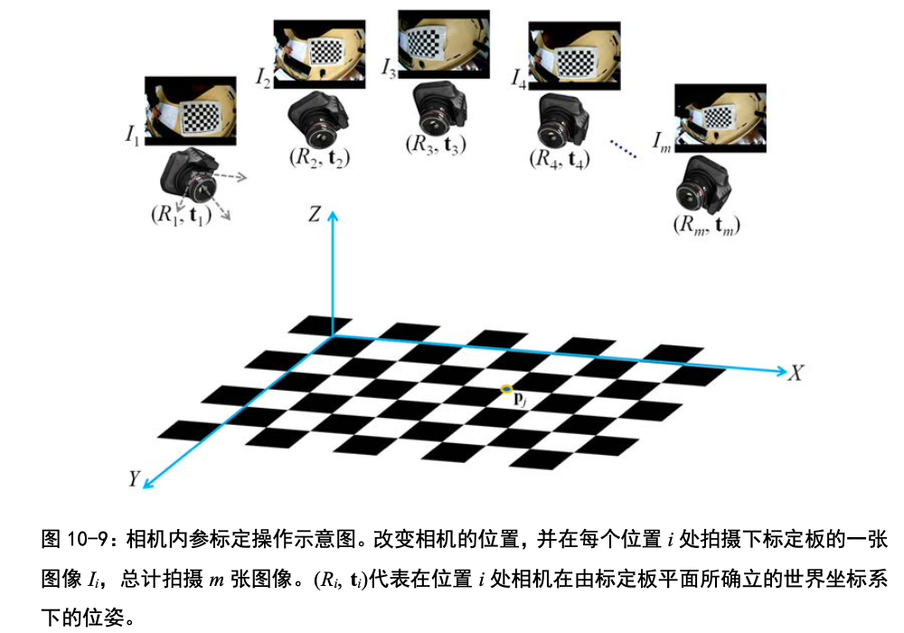

  - **优化目标函数**：对每张拍摄的图像，用交叉点检测算法检测出交叉点，建立物理空间和图像空间中点的对应关系$\{\bold{p}_j \leftrightarrow\bold{u}_{ij}\}_{j=1}^n$。根据成像模型计算$\bold{p}_j$在当前相机参数下的像素坐标，与实际坐标求出误差函数，并对所有图像、所有点进行求和。

- 最终**数学模型**：

$$
\Theta^*=arg_{\Theta}min\sum_{i=1}^m\sum_{j=1}^n\frac{1}{2}||K·\mathcal{D}\{\frac{1}{z_{cij}}[R_i\ \bold{t}_i]\bold{p}_j\}-\bold{u}_{ij}||_2^2
$$

其中$\Theta=\{f_x,f_y,c_x,c_y,k_1,k_2,\rho_1,\rho_2,k_3\,\{R_i\}_{i=1}^m\ \{\bold{t}_i\}_{i=1}^m\}$，包括了内参数（前9个）、外参数（后6m个）。

$j,n$表示一张标定图片中标定点的个数，即标定板上交叉点个数，一般为$9\times6=54$。

$i,m$表示拍摄的用于标定的图片，每次拍摄相机位姿不同，因此外参数有6m个，m一般为10～20。可以证明即使n足够大，也至少需要m≥2，且为了解的稳定性需要多拍一些。

#### 10.3.2 三维空间旋转的轴角表达

- 目的：刚才建立的数学模型中用$R_i$刻画相机位姿中的旋转，它是一个正交、$det(R_i)=1$的、自由度为3的矩阵（见第三章三维空间线性几何变换）。如果直接用矩阵表达，则是9个具有约束条件的优化变量，我们不希望引入约束条件，也希望优化变量个数等于其自由度3。
- 方法：用一个表示三维空间旋转的**三维向量**代替$R_i$，且向量各个维度不耦合，这样就用了最少的优化变量、摆脱了约束条件。
  - 三维欧氏空间旋转的**轴角表达**：$9个优化变量+额外约束\rightarrow不耦合的rpy旋转表示$
  - 任何三维空间中的旋转都可以表达为一个旋转轴的方向$\bold{n}\in\mathbb{R}^{3\times1},||\bold{n}||_2=1$（矢量末尾在单位球球面上，2个自由度）、一个绕旋转轴按右手法则逆时针旋转角度$\theta>0$（1个自由度）来确定，可以表达为三维向量$\bold{d}=\theta\bold{n}$（共3个自由度）
  - 三维向量$\bold{d}$可以直接确定$\bold{n}=\frac{\bold{d}}{||\bold{d}||_2},\theta=||\bold{d}||_2$。

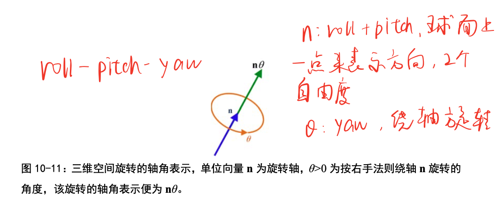

- 轴角表达—>旋转矩阵表达

  - 罗德里格斯公式：

  $$
  R=\cos\theta·I+(1-\cos\theta)\bold{n}\bold{n}^T+\sin\theta·\bold{n}^\wedge
  $$

  其中$I\in\mathbb{R}^{3\times3}$为单位矩阵，$\bold{n}^\wedge=\begin{bmatrix}
    0&  -n_3& n_2\\
    n_3&  0& -n_1\\
    -n_2&  n_1&0
  \end{bmatrix}$

- 旋转矩阵表达—>轴角表达

  - 确定$\theta$

  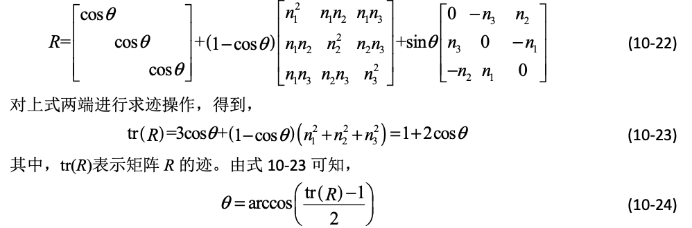
  
  - 确定$\bold{n}$：对轴$\bold{n}$施加旋转变换$R$后保持不动，因此满足$R\bold{n}=\bold{n}$，即$\bold{n}$为矩阵$R$特征值为1的单位特征向量。可以证明：
    - 1.矩阵R一定有一个特征值为1
    - 2.特征值1对应的特征子空间维度若大于1，则此时三个特征值必然全为1，$\theta=0$，没有选择，轴角表达为$\bold{0}$
    - 3.对应特征值1的单位特征向量的唯一性，$\bold{n}$和$-\bold{n}$都满足，则需要根据检验来决定旋转轴的选取。

- 改写数学模型（目标函数中$R_i$的表达、参数集合中$\{R_i\}_{i=1}^m$的表达）：
  - $\mathcal{R}(\bold{d}_i):|\mathbb{R}^{3\times1}\rightarrow\mathbb{R}^{3\times3}$表示把轴角$\bold{d}_i$通过罗德里格斯公式映射到对应的旋转矩阵

$$
\Theta^*=arg_{\Theta}min\sum_{i=1}^m\sum_{j=1}^n\frac{1}{2}||K·\mathcal{D}\{\frac{1}{z_{cij}}[\mathcal{R}(\bold{d}_1)\ \bold{t}_i]\bold{p}_j\}-\bold{u}_{ij}||_2^2
$$

其中待优化参数为$\Theta=\{f_x,f_y,c_x,c_y,k_1,k_2,\rho_1,\rho_2,k_3\,\{\bold{d}_i\}_{i=1}^m\ \{\bold{t}_i\}_{i=1}^m\}$。

#### 10.3.3 相机成像模型参数的初始估计

- （1/4）与镜头畸变有关的参数$(k_1,k_2,\rho_1,\rho_2,k_3)$
  - 镜头畸变无先验知识，都初始化为0。

- （2/4）主点坐标$(c_x,c_y)^T$
  - 光心在成像平面上的像素坐标，大致处于图像中心，因此初始化为$c_x=\frac{width}{2},c_y=\frac{height}{2}$，其中$width$和$height$分别为拍摄图片的像素宽高。
- （3/4）内参$(f_x,f_y)$
  - 理论解释涉及**消失点**和**非齐次线性最小二乘问题求解**，公式太多建议看书
  - 主点坐标和内参分别估计是OpenCV的简化方法；slides里通过消失点理论+解方程组共同估计了所有内参，即$K=\begin{bmatrix}f_x&0&c_x\\0&f_y&c_y\\0&0&1\end{bmatrix}$
- （4/4）外参数$\{\bold{d}_i\}_{i=1}^m,\{\bold{t}_i\}_{i=1}^m$

#### 10.3.4 相机成像模型参数的迭代优化

> 应用列文伯格-马夸尔特法进行优化，可看HW2第3题推导过程

### 10.4 镜头畸变去除

- 获得相机内参数（内参矩阵$K$）后即可对获取图像进行畸变去除，使用理想的针孔相机模型
- 带有镜头畸变的图像$I_d$，去畸变后图像$I$，$I$上一点$\bold{u}$，其对应的归一化成像平面坐标系下的点为$K^{-1}\bold{u}$，考虑镜头畸变变为$\mathcal{D}(K^{-1}\bold{u})$，再映射到像素坐标系$K(\mathcal{D}(K^{-1}\bold{u}))$，这便是畸变图像$I_d$上和点$\bold{u}$对应的点$\bold{u}_d$。
  - 之所以从去畸变图像点的坐标反推畸变图像点的坐标，和第六章中图像插值里讲的一样。

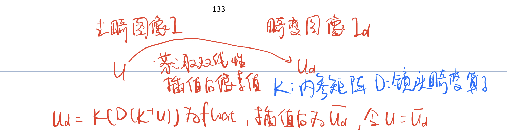

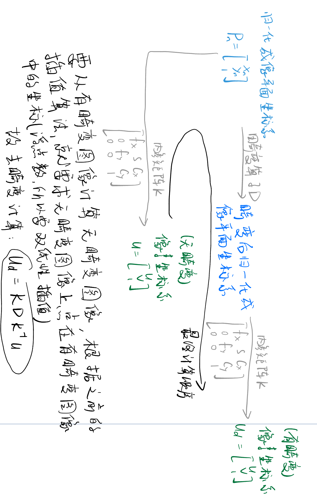

## 第11章 鸟瞰视图

### 11.1 基本流程

- 任务：拍摄了物理平面图像$I_D$，要从中生成平面鸟瞰视图$I_B$。需要建立从鸟瞰视图到原始图像的映射查找表$T_{B\rightarrow D}$（离线完成，和图像内容无关，只需要相机位姿），这样对于$I_B$上一点$\bold{x}_B$，可以通过查表得到$I_D$上与之对应的$\bold{x}_D$，赋值即可生成鸟瞰视图

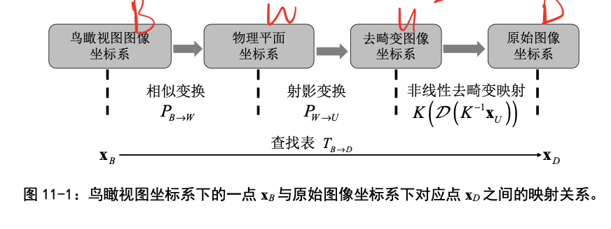

### 11.2 鸟瞰视图坐标系到物理平面坐标系的映射

- 鸟瞰视图图像坐标系和物理平面坐标系的映射关系$P_{B\rightarrow W}$是一个相似变换（缩放+平移）
  - $P_{B\rightarrow W}=\begin{bmatrix}\frac{h}{m}&0&-\frac{hn}{2m}\\0&-\frac{h}{m}&\frac{h}{2}\\0&0&1\end{bmatrix}$
  - 如果鸟瞰视图中心对应物理平面坐标系其他点，则平移量需要变

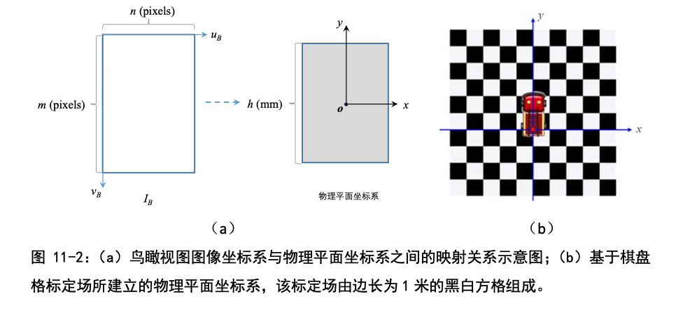

### 11.3 物理平面坐标系到去畸变图像坐标系的映射

- 物理平面和去畸变图像$I_U$之间满足射影变换关系，因此根据第五章最小二乘法解出$P_{W\rightarrow U}$

### 11.4 去畸变图像坐标系到原始图像坐标系的映射

- 实际是图像镜头畸变去除过程

$\bold{x}_U$为去畸变图像$I_U$上一点，其对应的带镜头畸变原始图像$I_D$上一点为$\bold{x}_D=K\mathcal{D}(K^{-1}\bold{x}_U)$，$K$为相机内参矩阵，$\mathcal{D}$为畸变算子。

综上，对于鸟瞰视图图像中一点$\bold{x}_B$，这样得到其原始图像中的对应点$\bold{x}_D$：

$\bold{x}_D=K\mathcal{D}(K^{-1}P_{W\rightarrow U}P_{B\rightarrow W}\bold{x}_B)$

再利用双线性插值，就得到了从鸟瞰视图到原始图像的映射查找表$T_{B\rightarrow D}$。

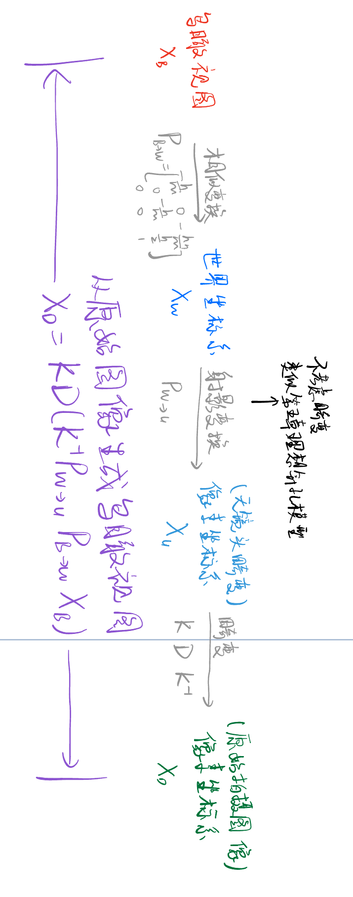

# 三、目标检测

# 四、三维立体视觉
